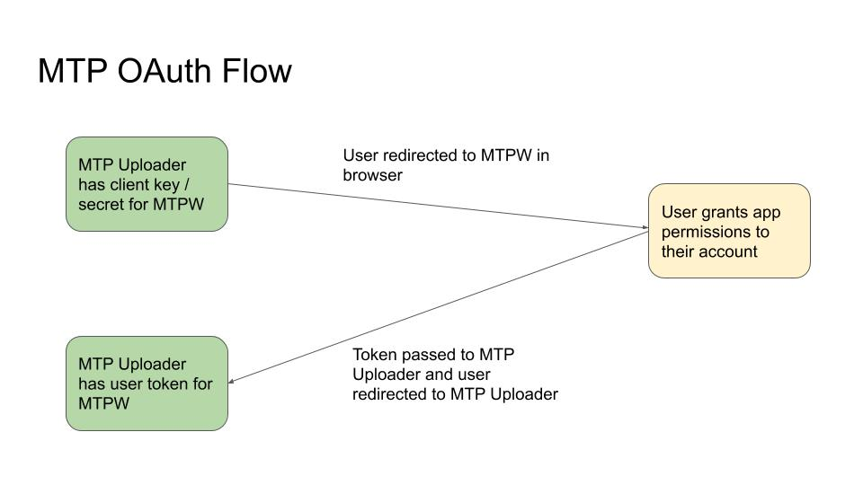

# Functions

This document is written to help developers understand the logic and function of the Map the Paths Desktop Uploader \(MTPDU\).

After reading this, you should be comfortable with how the MTPDU works and how you can modify it to suit your own needs, if so desired.

### 1. Authenticate

If;

```text
MTP_WEB_AUTH_URL=
MTP_WEB_APP_ID=
MTP_WEB_APP_SECRET=
```

Are defined in `/ROOT/.env`, a user will be required to authenticate with [Map the Paths Web \(MTPW\)](https://mtp.trekview.org/).

The `MTP_WEB_AUTH_URL=` allows you to change the MTPW server. In production this is `https://mtp.trekview.org/connect` but if your testing MTPW locally or in a staging environment, you can edit this setting as required.

You can create an application in MTPW under developers. You can then use `CLIENT_ID` and `CLIENT_SECRET` generated in the web app in the `.env` file.

When user token obtained, it is stored in the app.

Upon starting the app, if there is no valid authentication token \(does not exist or gets unauthorized response\), user will be prompted to authorise MTPDU to access their MTPW account.

MTPW OAuth tokens do not have any expiration time so typically last forever. However, the user can at any time manually revoke the token directly from their account settings page \(authorized apps\) on MTPW.

For testing, or when MTPW is not required you can use these values blank and this authentication to MTPW will not be required in the app.

**Note on creating an app in MTPW**


To create an app in MTPW you must:

1. Go to create app on MTPW
2. Enter the following values
   1. **Name:** A name that will be shown to users when they grant your application access to their account
   2. **Client type:**
      1. For MTPDU set to `public`
   3. **Client autorization grant type**
      1. For MTPDU set to `implicit`
   4. **Redirect URIs:**
      1. For MTPDU use local path, e.g. `app.mtp.desktop://app`
3. Copy your MTPW `CLIENT_ID` and `CLIENT_SECRET` into your MTPDU `.env` file.
4. Set the `MTP_WEB_AUTH_URL` value to the MTPW server
   1. the default \(production server\) is `https://mtp.trekview.org/authorize`
   2. the staging server you can user for testing is `https://map-the-paths-develop.herokuapp.com/authorize`
   3. If you are running a development instance of MTPW, this will be your local server address

**Map the Paths OAuth Flow**



When a user tries to login, they will grant the MTPW Oauth app access to act on their behalf \(see setup\).


When they click integrate/authenticate to MTPW at login it will open a browser window for user to authorise your app.

If user clicks allow, the browser will redirect the user \(and token generated\) back to the MTP web \(using callback URL\).


Token is then automatically passed to MTP Uploader with user automatically redirected to MTP Uploader \(after clicking "open app"\) in browser.

This flow is performed every time app is opened to ensure user token is valid.

### 2. Sequence List


This page renders all user created sequences in MTPDU only.

It does not show any sequences created in MTPW \(using Mapillary import\).

It pulls the data from `sequence.json` files, under `ROOT/sequences/SEQUENCE_NAME/SEQUENCE_NAME.json`

User can delete a sequence in this view using delete icons in each sequence card. This will completely delete the sequence directory, e.g. `ROOT/sequences/SEQUENCE_NAME` \(including all processed held in it\)

### 3. Add name


User enters a:

* Sequence name \(text, &gt;6 chars, unique, required\)

All sequence names are user in directory and filenames in snake\_case. As such they must be unique.

### 4. Add description


User enters a:

* Sequence description \(text, optional\)

### 5. Add tags


User can assign 0 or more tags to the sequence.

User can also define their own tag. Tags can only contain alphanumeric and “-” chars. Max 30 characters per tag. Max 15 tags.

### 6. Add transport type \(parent\)


Transport types have a parent - child relationship.

User first selects parent type.

Transport types are modularised and can be modified in `ROOT/transports/transport-methods.json`.

An excerpt of the parent \(`Powered`\) and children \(`Car` and ****`Electric Car`\) transport types are shown below.

Icons assigned to methods and types are sourced from Font Awesome.

We currently implement the free version of Font Awesome icons. [You must use a free Font Awesome icon](https://fontawesome.com/icons?m=free) for the type under `"icon"` value.

["`mtp_api`" is the transport\_type value used to create a sequence in MTPW.](../../mtp-web/developer-docs/api.md#create-sequence)

```text
{
  "Powered": {
    "type": "Powered",
    "icon": "fas fa-car-battery",
    "description": "",
    "children": [
      {
        "type": "Car",
        "icon": "fas fa-car",
        "description": "",
        "secondary_parent": "Land",
        "mtp_api": "Powered-Car"
      },
      {
        "type": "Electric Car",
        "icon": "fas fa-charging-station",
        "description": "",
        "secondary_parent": "Land",
        "mtp_api": "Powered-Electric Car"
      }
    ]
  }
}
```

### 7. Add transport type \(child\)


Depending on parent transport type selected, user shown child transport types and is required to select one by clicking.

### 8. Add camera


User can select camera, or default to "Other camera" option. "Other camera" is simply a catch all for cameras we have not tested.

Note, this step performs no validation, and has no effect on the sequence. The camera make / model is extracted from the EXIF data during the processing step. It is simply designed to explicitly demonstrate supported cameras to user in case of errors with "Other camera" option.

Cameras are modularised and can be modified in `ROOT/cameras/`.

Each camera has its own directory using the naming convention `CAMERA_MANUFACTURER-CAMERA_MODEL`.

Inside each directory is a:

* `module.json` \(example shown below\):
  * Contains the UI text elements used on add camera screen.
  * Currently only `module_camera_exif_make` + `module_camera_model` are shwon in this view
  * This file contains lots of unused fields that we hope to utilise in later versions of the software, hence are including them now \(e.g. `module_camara_supports`\).
* `module-icon.png`:
  * The image \(.png, 512x512\) used on add camera screen.

**Example of camera `module.json`**

```text
{
    "module_developer": "Trek View",
    "module_support_url": "https://campfire.trekview.org/c/support/8",
    "module_name": "GoPro Max",
    "module_description": "Max HyperSmooth delivers the smoothest video ever from a GoPro—plus game-changing horizon leveling, when you want it.",
    "module_camera_exif_make": "GoPro",
    "module_camera_model": "MAX",
    "module_camara_supports": [ "mp4", "jpg" ],
    "module_camara_video_telemetry": "gmpf"
}
```

### 9. Add capture method


User can choose either video or image format for sequence.

This again is a self validation step for user, and determines the file type user is allowed to upload at next step.

Both of these items are on the roadmap.

### 10. Select imagery


Here a user can select a directory of images or video files to create sequence, depending on what option they selected at step 9 \(choose capture method\).

Currently the app only supports following file formats

* Image
  * `jpg`
  * `jpeg`
* Video
  * `.mp4`

App will validate the extension name only \(case insensitive\). If incorrect, will warn user and ask them to choose another file.

The app does not actually verify if file format actually matches extension. If this is the case, the app will still try to process the files, resulting in an error.

#### 10.1 Check for corrupted images

User also has option to select:

> Check for corrupted \(black\) images \(only recommended you tick this box if you suspect the file\(s\) contain black and/or visually corrupted frames\)

If selected, the app uses imagemagick to analyse the image colours.

Imagemagick returns statistics on an image, for example;

```text
Image statistics:
    Overall:
      min: 0  (0)
      max: 32 (0.12549)
      mean: 13.6515 (0.0535352)
      standard deviation: 5.70764 (0.0223829)
      kurtosis: -0.479415
      skewness: 0.754623
      entropy: 0.742424
```

The mean value reports the mean average of red \(0,255\), green \(0,255\) and blue \(0,255\) values of image.

The lower the mean, the darker the image \(0 is 100% black\). The higher the mean, the lighter the image \(255 is 100% white\).

By default, if user marks checkbox each frame is analysed and if a value of between 55 and 200 is returned the frame is considered valid. Otherwise it is considered visually corrupt and discarded.

[A Python implementation of this process can also be seen here](https://github.com/trek-view/corrupted-image-cleaner).

### 11. Process input


#### 11.1 Photos input

User must upload at least 2 images in timelapse. Must be accepted format.

#### 11.2 Input Projection

The app accepts both 2D and 360 images and videos \(`projection=equirectangular`\). In the case of 2D images, user will not be able to add nadir step \([see add a nadir](functions.md#18-add-nadir-advanced-setting)\).

#### 11.3 GPS

It is recommended to user images are geotagged and videos have geo telemetry \(e.g CAMM track\) -- but this is not essential \(keep reading\).

For photos, app uses exiftool to read following values of image to determine geo info;

* \[GPS\]`GPSTimeStamp` \(required\)
* \[GPS\] `GPSDateStamp` \(required\)
* \[GPS\] `GPSLatitude`\(required\)
* \[GPS\] `GPSLatitudeRef`
* \[GPS\] `GPSLongitude`\(required\)
* \[GPS\] `GPSLongitudeRef`
* \[GPS\] `GPSAltitude`\(required\)
* \[GPS\] `GPSAltitudeRef`

If a required value shown above is missing in photo EXIF, app assumes image is not geotagged.

For video, app reads;

* \[EXIF\] `GPSDateTime`

If the value shown above is missing in video EXIF, app assumes video is not geotagged.

This check is performed to understand what workflow to proceed with \([see Image / video processing workflow](functions.md#11-5-image-video-processing-workflow)\)

If no geo data is found in image, image is considered to have no geotag. App therefore defaults to `DateTimeOriginal` of the image.

#### 11.2 Video frame extraction \(VIDEO ONLY\)

[The app uses ffmpeg to break video into frames \(.jpg image files\)](https://github.com/trek-view/mtp-desktop-uploader/blob/develop/app/scripts/video.ts).

At present we set a fixed extraction of 1 frame per second.

The app also extracts GPS telemetry during process of breaking video down into frames. This is done using exiftool. Here is a sample command of how it's done:

```text
exiftool -ee -G3 VIDEO_7152.mp4 > VIDEO_7152_track_metadata.txt
```

This .txt file is also outputted into the `SEQUENCE_ID/originals` folder on Sequence creation.


Design decision: we struggled with using ffmpeg and exiftool to extract telemetry tracks from some gpmf and camm files at sub-second resolution. [See this post for gmpf example where only ](https://www.trekview.org/blog/2020/metadata-exif-xmp-360-video-files/)on GPS Date time value is reported per second, but multiple lat/lons are reported per second. This is something on the roadmap to improve. If you have any suggestions, [please email me](https://www.trekview.org/contact/).


Design decision: we struggled with using ffmpeg and exiftool to extract telemetry tracks from some gpmf and camm files at sub-second resolution. [See this post for gmpf example where only ](https://www.trekview.org/blog/2020/metadata-exif-xmp-360-video-files/)on GPS Date time value is reported per second, but multiple lat/lons are reported per second. This is something on the roadmap to improve. If you have any suggestions, [please email me](https://www.trekview.org/contact/).

When frames are extracted, the app then uses exiftool to inject the extracted metadata into the frames.

At this point the following GPS data is written into each image:

* \[EXIF\] `DateTimeOriginal`=`GPSDateStamp + GPSTimeStamp`
* \[EXIF\] `GPSDateTime`=`GPSDateStamp + GPSTimeStamp`
* \[GPS\]`GPSTimeStamp` 
* \[GPS\] `GPSDateStamp`
* \[GPS\] `GPSLatitude`
* \[GPS\] `GPSLatitudeRef`
* \[GPS\] `GPSLongitude`
* \[GPS\] `GPSLongitudeRef`
* \[GPS\] `GPSAltitude`
* \[GPS\] `GPSAltitudeRef`

Note, it is possible that GPS signal is lost during a section of video meaning some frames will result in no geotags, and thus `DateTimeOriginal`.

In addition to extracted GPS data, app will attempt to copy all original EXIF data from video to each image \(e.g. `[XMP] ProjectionType`\).

#### 11.4 Write out image files

At this point, a new directory is created under `/mapthepaths/SEQUENCE_NAME`.

In this directory an `originals` directory is created.

In the case of:

* photos, this holds the raw photos selected \(essentially a mirror copy of directory user selected\)
* video, this holds the frames extracted from the video and the raw video

#### 11.5 Image / video processing workflow


Step 1 in the diagram above shows the start of the image / video processing workflow that starts at step 10 upload images.

### 12. Add GPX track


If;

* all images have resolvable geotags
  * will proceed to straight to modify spacing step. User can access this step by clicking add GPX track button. Useful if they have a more accurate GPX track over that reported by camera.
* some images have resolvable geotags
  * will warn user some images are not tagged. Giving them option to add gps track \(step 6\), OR discard non-geotagged images.
* no images have resolvable geotags
  * will warn user no images are not tagged. Giving them option to add gps track \(step 6\), OR abandon tour creation.

#### 12.1 Add GPX track

This step is required if no images have geotags and user will be forced to upload gpx file.

Else is optional.


In such case, the user can access this function on the UI view of step 14. Modify GPS Spacing

User must select a valid `.gpx` track for matching.

#### 12.1.1 How GPS-image matching works

A GPX file with trackpoints `<trkpt>` that contain latitude `lat`, longitude `lon`, elevation `ele` and time `<time>` values, e.g.

```text
<trkpt lat="28.689014" lon="-13.931480"><ele>92</ele>
<time>2020-08-02T11:05:06Z</time></trkpt>
<trkpt lat="28.689009" lon="-13.931502"><ele>93</ele>
<time>2020-08-02T11:05:09Z</time></trkpt>
<trkpt lat="28.689007" lon="-13.931502"><ele>91</ele>
<time>2020-08-02T11:05:10Z</time></trkpt>
```

Each image file should contain a `DateTimeOriginal` value \(e.g. 2020-08-02T11:05:06\).

The GPS-image process first identified the images `DateTimeOriginal` value to find corresponding time record in `.gpx` file at second resolution. `GPSDateStamp + GPSTimeStamp` are not used for track assignment, because it is assumed value does not exist or is corrupt.

Matches are to tenth-of-a-second resolution when `DateTimeOriginal` reports to this level of granularity. For example, `DateTimeOriginal=10:02:01:00023` and `<time>10:02:01:00288</time>` are considered a match. Whereas, `DateTimeOriginal=10:02:01:10023` and `<time>10:02:02:20023</time>` are not a match.

Matches are to a second resolution when `DateTimeOriginal` reports to this level of granularity. For example, `DateTimeOriginal=10:02:01` and `<time>10:02:01:00288</time>` are considered a match. Whereas, `DateTimeOriginal=10:02:013` and `<time>10:02:02:20023</time>` are not a match.

If multiple times in gpx trackpoints match `DateTimeOriginal` value, the first record is used to assign geotags to image.

If

* a match is found between`DateTimeOriginal` of image and `<time>` in GPX track , the image is geotagged with these values:
*  * \[GPS\]`GPSTimeStamp` 
  * \[GPS\] `GPSDateStamp`
  * \[GPS\] `GPSLatitude`
  * \[GPS\] `GPSLatitudeRef`
  * \[GPS\] `GPSLongitude`
  * \[GPS\] `GPSLongitudeRef`
  * \[GPS\] `GPSAltitude`
  * \[GPS\] `GPSAltitudeRef`
* a match is not found between`DateTimeOriginal` of image and `<time>` in GPX track, the image is discarded.

This process will overwrite any existing geotags.

#### **12.1.1 Adjusting image`DateTimeOriginal`**


> The start time of your GPS Track is: 2020-08-02T11:05:06‌
>
> The time in the first photo in the sequence is: 2020-08-02T13:42:06‌
>
> There are no matched points between Photos and Gpx Points. Maybe you have to change the start time of Gpx points.

In some cases, the `DateTimeOriginal` of an image may be incorrect. This can happen for a number of reasons. It is usually down to the time on the camera being set incorrectly. Many cameras do not use a central time server, and let user manually define time. As such, it is not uncommon for images`DateTimeOriginal` value to be incorrect.

In such cases, user can manually modify the `DateTimeOriginal` values by setting a global time offset. For example, add 3600 seconds \(1 hour\) to every images `DateTimeOriginal` value.

Time offset can be both positive or negative number \(integer\).

After uploading GPX track user will be presented with screen showing track start time \(first gpx trackpoint\), and first image time \(earliest `DateTimeOriginal` value \).

In the above example, you can see the GPS track time is much earlier then the first photo time \(first photo time is 2 hours 37 minutes after the first gpx point\).


In this example, let's assume user knows first gpx time is the time of the first photo.

Therefore the time offset would be -9420 seconds \(2 hours 37 minutes\).


> The start time of your GPS Track is: 2020-08-02T11:05:06
>
> The time in the first photo in the sequence is: 2020-08-02T11:05:06
>
> We found the first matching gps record in the track for this photo at lat=28.689014 lon=-13.93148 alt=92 at 2020-08-02T11:05:06.

Finishing the example, you can see once the offset is applied, the first gpx trackpoint and first image time now match, and a match has been detected.

### 13. Calculate temporary sequence

This step is invisible to the user.

Once a processing complete \(that is GPS track added, if required\) a temporary sequence \(path\) is calculated using location values.

The sequence connects photos based on ascending `GPSDateStamp + GPSTimeStamp` time. Essentially the earliest photo time is first photo in sequence. the latest photo time is last photo in sequence.

First and last photos in sequence always have 1 connection \(either forward \(first\) or back \(last\)\). All other photo connections will have 2 connections \(both forward and back\).

See the linked sample `sequence.json` for the information held against a sequence. This file is produced as an output for user on sequence creation completion.




For each connection, the following is calculated:

```text
"distance_mtrs": ## reported in meters (can be negative, if source photo taken after destination photo),
"elevation_mtrs": ## reported in meters (can be negative if destination photo is lower)
"time_sec": ## reported in seconds (can be negative, if source photo taken after destination photo),
"speed_kmh": ## reported in kilometers per hour (can be negative, if source photo taken after destination photo),
"heading_deg": ## reported in degrees between 0 and 359.99 degrees,
"adj_heading_deg": ## reported in degrees between 0 and 359.99 degrees. reported for previous photo connection only,
"pitch_deg": ## reported in degrees between -90 to 90 degrees
```

Throughout each step in the process where a change is made \(e.g. modify heading\) a temporary sequence file is recreated reflecting the changes made by the user.

The "Reset modifications" button on each following page resets all values user entered on that page to the original value. Performing this action does not reset any values set on other screen by the user. To edit these, they must go back to the corresponding step.

Whenever user updates variable during modify steps:

* this will be shown in the map view immediately to user to give them an accurate visual representation of how their changes will affect the final imagery 
* the temporary sequence information will be immediately updated \(e.g. distance to next photo\)

### 14. Skip modifications


In many cases users do not need or want to make the following \(optional\) changes to their images \(steps 15 - 18\).

We do not want to force these users to have to manually skip through the following modification steps and therefore give them the option to skip them.

If they are happy with the processing step, they can click skip modifications and will move straight to the upload to integrations step \(step 19\).

### 15. Set image spacing \(advanced setting\)


User can select either to space frames by time OR distance. When value entered into one field, the other will grey out.

#### 15.1 Frames ever \[x\] seconds

User can decide how far photos should be spaced using time.

Time uses `GPSDateStamp + GPSTimeStamp` of image.

This option is useful when user has lots of images close together on map because they are moving slowly. For example, traveling a 1 meter/second and taking a photo every second gives a photo every meter. Maybe they want photos every 5 seconds.

User can enter value between 1 and 20 seconds. For example, a value of 5 means 1 photo every 5 seconds. A value of 1 means 1 photo every 1 seconds.

It is not possible to always have exact times \(i.e. if user has timelapse of 6 seconds and selects 8 second spacing\), As such app assumes time must be &gt;= to value entered.


Design decision: We want to increase image resolution options \(e.g. more than one photo a second\) in later versions. This is on the roadmap. See video peo


When user inputs change, the logic of the calculation is as follows:

1. User enters new seconds value
2. App analyses first time value between photo 1&gt;2.
3. If
   * time &lt; value entered discards destination photo \(2\) and calculates new connection 1&gt;3
   * time &gt;= value entered keeps destination photo \(2\) and calculates next connection 2&gt;3

**15.1.1 Frames ever \[x\] seconds example**

Photos are 1 second apart. User enters value in seconds of 5.

1. Time from 1 to 2 calculated.
   * Is 1 second so photo 2 discarded.
2. Time from 1 to 3 calculated.
   * Is 2 seconds so photo 3 discarded.
3. Time from 1 to 4 calculated.
   * Is 3 seconds so photo 4 discarded.
4. Time from 1 to 5 calculated.
   * Is 4 seconds so photo 5 discarded.
5. Time from 1 to 6 calculated.
   * Is 5 seconds so photo 6 kept.
6. Time from 6 to 7 is calculated.
   * Is 1 second so photo 7 discarded
7. ...

#### 15.2 Frames ever \[x\] meters

User can decide how far photos should be spaced using distance.

Distance uses `GPSLatitude`=`GPSLatitude`.

This option is useful when user has lots of images close together on map because they are moving slowly and know exactly how far they want photos to be spaced by distance. For example, traveling a 1 meter/second and taking a photo every second gives a photo every meter. Maybe they want photos every 5 meters.

User can enter value between 1 and 20 meters. For example, a value of 20 means 1 photo every 20 meters. A value of 1 means 1 photo every 1 meter.

It is not usually possible to have exact distances \(i.e. it is very unlikely photos ever 20m apart if captured on bike, for example\), As such app assumes distance must be &gt;= to value entered.

We want to increase image resolution options \(e.g. more than one photo per meter\) in later versions. This is on the roadmap.

When user inputs change, the logic of the calculation is as follows:

1. User enters new distance value
2. App analyses first distance value between photo 1&gt;2.
3. If
   * distance &lt; value entered discards destination photo \(2\) and calculates new connection 1&gt;3
   * distance &gt;= value entered keeps destination photo \(2\) and calculates next connection 2&gt;3

**15.2.1 Frames ever \[x\] meters example**

Photos are 1 meter apart. User enters value in meters of 5.

1. Distance from 1 to 2 calculated.
   * Is 1 meter so photo 2 discarded.
2. Distance from 1 to 3 calculated.
   * Is 2 meters so photo 3 discarded.
3. Distance from 1 to 4 calculated.
   * Is 3 meters so photo 4 discarded.
4. Distance from 1 to 5 calculated.
   * Is 4 meters so photo 5 discarded.
5. Distance from 1 to 6 calculated.
   * Is 5 meters so photo 6 kept.
6. Distance from 6 to 7 is calculated.
   * Is 1 meter so photo 7 discarded
7. ...

### 16. Fix Photo Outliers \(advanced setting\)


In many cases, a GPS track might be corrupt in places. This happens for a number of reasons. In such case, user might want to discard or normalise these photos based on the deviation from the norm.

User can use either options entered on this page, but not both. When value entered into one field, the other will grey out.

#### 16.1 Discard photos \[x\] meters off path

Sometimes, user might want to discard images with corrupt GPS. To to this they can discard all corrupted GPS points based on distance from the expected path.

Users can discard all photos that fall outside this norm based on forward and backward connections.

When user inputs change, the logic of the calculation is as follows:

1. User enters new distance value and clicks discard
2. App analyses the first 3 connections \(photo time 1 to photo time 2 to photo time 3\)
3. If
   * both connection distance values are greater than the discard value \(p1 to p2, and p2 to p3\), then the middle photo \(P2\) is discarded
   * 0 or 1 connection distance values are greater than the discard value \(p1 to p2, and p2 to p3\), then the middle photo \(P2\) is kept
4. App analyses next 3 photos

#### 16.1.1 Discard photos \[x\] meters off path example


In the 2 examples above, all photos should be no more than 90m apart. Or put another way the discard value is 90m.

In example 1;

1. Distance from P1 to P2 calculated, and distance from P2 to P3 calculated
   * P1 &gt; P2 = 110m and P2 &gt; P3 = 120m. Both values are greater than 90 so p2 discarded.
2. Distance from P3 to P4 calculated, and distance from P4 to P5 calculated
   * ...

In example 2;

1. Distance from P1 to P2 calculated, and distance from P2 to P3 calculated
   * P1 &gt; P2 = 80m and P2 &gt; P3 = 100m. Only one value is greater than 90 \(P2&gt;P3\) so p2 kept.
2. Distance from P2 to P3 calculated, and distance from P3 to P4 calculated
   * ...

#### 16.2 Discard photos manually


User can also click a point on the map, and then select the delete icon to delete images manually. This is useful to avoid the simple global discard calculation.

#### 16.3 Smooth photos \[x\] meters off path

In other cases, user might want to fix corrupt GPS. To to this they can smooth corrupted GPS points based on distance from the expected path.

Smoothing essentially finds the midpoint between first and last connections in a trio \(e.g. P1, P2, P3\) and then assigns the returned latitude and longitude to the middle photo \(e.g. P2\). The altitude for the normalised photo \(e.g. P2\) is also adjusted to the vertical midpoint of P1 and P3 \(e.g. calculation: \(altitude P1 + altitude P3\) / 2 = altitude P2\).

When user inputs change, the logic of the calculation is as follows:

1. User enters new distance value and clicks smooth
2. App analyses the first 3 connections \(photo time 1 to photo time 2 to photo time 3\)
3. If
   * both connection distance values are greater than the smooth value \(p1 to p2, and p2 to p3\), then the middle photo \(P2\) is adjusted with normalised GPS values
   * 0 or 1 connection distance values are greater than the smooth value \(p1 to p2, and p2 to p3\), then the middle photo \(P2\) remains unchanged
4. App analyses next 3 photos

#### 16.3.1 Smooth photos \[x\] meters off path example


In the 2 examples above, all photos should be no more than 90m apart. Or put another way the smooth value is 90m.

In example 1;

1. Distance from P1 to P2 calculated, and distance from P2 to P3 calculated
   * P1 &gt; P2 = 110m and P2 &gt; P3 = 120m. Both values are greater than 90 so p2 is smoothed to path.
2. Distance from P2 to P3 calculated, and distance from P3 to P4 calculated
   * ...

In example 2;

1. Distance from P1 to P2 calculated, and distance from P2 to P3 calculated
   * P1 &gt; P2 = 80m and P2 &gt; P3 = 100m. Only one value is greater than 90 \(P2&gt;P3\) so P2 values kept.
2. Distance from P2 to P3 calculated, and distance from P3 to P4 calculated
   * ...

### 17. Modify heading \(advanced setting\)


If heading value is captured by cameras in images \(some cameras do not report it\), it is under `[XMP] PoseHeadingDegrees`. In cases when this exists, the value remains unmodified.

If it does not exist, the script automatically calculated this value \(see: Calculate preliminary sequence\).

Note, the same process is done for pitch \(vertical angle\) `[XMP] PosePitchDegrees`. However, modification of this value is not exposed to the user. This is on the roadmap.

Users can set the same offset of compass angle \(degrees\) to all the images in the sequence. This is useful when you know your compass is off by a certain degree.

The value entered is an offset. Meaning add the value entered to the `[XMP] PoseHeadingDegrees` value of image \(because all images will likely have varying headings\).

User can set offset value of between 0 and 360.

For example, entering an offset value of 10 means add 10 degrees to `[XMP] PoseHeadingDegrees`.

Each point on map should show heading set graphically to allow user to get a quick visual understanding of direction.

If user clicks point on map, will show panorama view and all heading and pitch info. User cannot change values individually, it is just for reference. This is available in all map views during processing.

#### 17.1 Viewing heading of a photo


  
When any map point clicked during sequence creation, the corresponding photo is shown to user \(with interactive Pannellum window if 360\). User can also view the following information about the photo when a map point is clicked:‌

* File Name
* GPS Time
* Heading / Azimuth \(degrees\)
* Distance to next photo \(meters\)
* Time to next photo \(seconds\)

This data is updated as changes are made, and will reflect any previous changes made to sequence edits.

### 18. Add nadir \(advanced setting\)


A nadir is a logo placed in the bottom of a 360 image. It often contains a logo.

A nadir is uploaded by user in 2d format, which means it first needs to be transformed into an equirectangular \(360\) image before being overlaid on 360 panorama.

If photos are 2D this step is automatically skipped as a nadir cannot be added to a 2D image.


Currently the app only supports .png files for nadir, that are have square dimensions \(length = height\) and is more than 500px x 500px \(length x height\).

App will validate the correct extension only. If incorrect, will warn user and ask them to choose another file.

User can also select default nadir. These are stored \(and new ones can be added\) in the app here under `/ROOT/static/nadir/`.

[This standalone script demonstrates how nadirs are overlaid on panoramas](https://github.com/trek-view/nadir-patcher).

Essentially to overlay the nadir, the following processing steps are applied:

1. the nadir is converted into equirectangular format
2. then stretched to width of 360 photo
3. overlayed onto the 360 photo at the bottom of image
4. and height of nadir modified as specified \(see nadir preview\).

The app makes a simple assumption that all photos have the same resolution \(width x height\) to reduce processing requirements. Therefore the nadir output is created once during the preview step and then simply overlaid to all sequence images.

#### **18.1 Nadir preview**


This takes the first image in the sequence and renders it with nadir for user to check output of nadir before applying to entire sequence.


16 versions are created with nadir sizes between 10% and 25% of image height. When user modifies % in UI using slider, it calls one of these temporary images. These temporary images are stored in the `ROOT/` directory. If user exits the add nadir step, or once nadir confirmed to be added the app deletes these temporary files.

### 19. Authenticate to integrations


At the final stage of the process, user can also choose to upload their imagery to a range of destinations.

Integrations are modularised in `ROOT/integrations/`.

[More information about building new integrations can be read in the in the integrations section of the docs here.](integrations/)

Note, some integrations only support certain types of images. These are based on:

* projection type: for example some integrations only support 360 images \(equirectangular images\)
* transport type: for example some integrations only support images taken on the ground \(i.e. not method=air\)

This information is defined in integration module config. The UI of the app will not show user an integration if the image projection and/or transport type of images in their sequence is not supported by that integration.

The integrations step can be performed in the create sequence workflow, at this stage of the tour creation flow. If user does not upload to integration during the create sequence workflow \(it is optional\), they can select upload to integration on sequence list view at a later date. At which stage they are redirected to integration authenticate screen.

User can select multiple integrations. For example, once Mapillary Oauth granted, goes back to integrations screen showing Mapillary selected but also shows option to add other destinations \(e.g Google Street View\). User can also unselect a destination on this screen if they change their mind.

If  `final_nadir` directory:

* exists, these images are uploaded to integrations
* else, upload `final_raw` images

App retries to upload image 3 times, then return error and move to next image.

Once user selects a destinations, user can select, "Upload to selected destinations". Upload to destination will start. In UI user will see progress screen showing count of images to be uploaded, and current count of images uploaded to each integration \(e.g 1/200 uploaded to Mapillary, 1/200 uploaded to Google Street View\).

The app logs all responses \(and oftentimes more\) from each service to keep a local record of image \(and sequence, where supported\) uploads. See each module for more information about what is logged.

In sequence list, if user has uploaded to integration should show link \(with logo\) to first photo in sequence uploaded to the destination. For example, will link to Mapillary photo view for 1st photo in sequence, assuming Mapillary integration exists.

### 20. Creation and upload

Once user confirms the final step;

* a permanent sequence file is generated \(`.json`\)
* a gpx track file is created \(`.gpx`\)
* copies of images with `ImageDescription` containing a MTP JSON object are written to sequence directory, in subdirectories as follows;
  * `final_raw`: final sequence imagery without nadir or blur
  * `final_nadir`: final sequence imagery with nadir but without blur \(optional, if selected by user\)
* if selected, photos synced with MTPW.


Note, more than one sequence \(and thus directories with above files\) might be created during this process. [See sequence limitations.](functions.md#20-0-sequence-limitations)


Note `final_raw` and `original` subdirectories are different. `original` subdirectory holds all images including those discarded during sequence creation \(due to filtering\). `final_raw` contains only the images that remain in the final sequence and have MTP metadata.

All original metadata in raw images is retained unless changes are made to such value during sequence creation workflow \(e.g. heading updated\).

#### 20.0 Sequence limitations

Sequences can have a maximum of 500 photos. If sequence uploaded by user has more than 500 photos, it will be split into parts with a maximum of 500 photos.

The user does not see this on creation, they simply create one sequence. However, the output will append Part 1 onto the title. All other meta-data \(description, tags, transport type\) will all remain the same.

For example, a sequence with 1900 photos will be split into 4 parts. In this case, if a user names the sequence "My sequence" on creation this will be split into 4 sequences on processing named; My sequence Part 1, My sequence Part 2, My sequence Part 3, and My sequence Part 4. 4 output directories and associate files will be generated for each of the 4 sequences.

#### **21.1 Image processing precedence**

Photos are processed one-by-one in the following order;

1. `final_raw`: exiftool writes new metadata to image
2. `final_nadir`: `final_original` images copied to directory, nadir patch overlaid

For example, all images in sequence will be written to `final_original`. When complete, if user has selected to add a nadir, a copy of these photos will be placed in `final_nadir` after nadir patch applied.

#### **21.2 `ImageDescription` JSON object**

[MTPW uses a JSON object in the \[EXIF\] ImageDescription field to process imagery](https://github.com/trek-view/mtp-api).

The JSON object inside each image has the following values;

* `MTPUploaderSequenceUUID` \(string\): UUID assigned from MTP Uploader \(only used to clarify if images are in same sequence. Additional UUID generated on MTPW once uploaded to avoid possible collisions\)
* `MTPUploaderPhotoUUID` \(strong\): UUID assigned from MTP Uploader \(Additional UUID generated on MTPW once uploaded to avoid possible collisions\)
* `MAPLongitude` \(float\): Longitude of the image
* `MAPLatitude` \(float\): Latitude of the image
* `MAPAltitude` \(float\): Altitude of the image
* `MAPCaptureTime` \(string\): Capture time in UTC, specified in the format of `%Y_%m_%d_%H_%M_%S_%f`. For example, the standard time `2019-12-29T10:25:39.898Z` should be formated as `2019_12_29_10_25_39_898`.
* `MTPSequenceName` \(string\): Name of sequence
* `MTPSequenceDescription` \(string\): Description of sequence
* `MTPSequenceTransport` \(string\): Transport used to capture sequence in main-sub format. e.g. `land-hike`.
* `MTPSequenceTags` \(list\): List `[]` of sequence tags.
* `MTPImageCopy` \(string\): Both final unmodified images, and nadir copy of images can be uploaded \(if exists\). Either `final_raw` or `final_nadir`
* `MTPImageProjection` \(string\): either `flat` or `equirectangular` depending on type of image.

An example of a final object in the ImageDescription field will look like this:

```text
{"MTPUploaderSequenceUUID":"cdc04260-6d8f-4d91-8903-fb79a9197b8a","MTPUploaderPhotoUUID":"a092d009-503c-4e19-9dad-63156f4ff573","MAPAltitude":319.248,"MAPLatitude":28.7151519999722,"MAPLongitude":-13.8921749,"MAPCaptureTime":"2020_08_14_11_43_46_000","MTPSequenceName":"My first sequence","MTPSequenceDescription":"It's description","MTPSequenceTransport":"Water-Paddleboard","MTPSequenceTags":["water","river","lake"],"MTPImageCopy":"final_raw","MTPImageProjection":"flat"}
```

#### **21.3 Sequence JSON file**

The sequence JSON file is used locally by the application to render sequence data in the UI.

It is also useful for more technical users if they wish to export more detailed information about their sequence to other tools.

The sequence JSON file takes the following format:

```text
{
	"sequence" : {
		"id": # UUID of sequence,
		"distance_km": # total distance using all positive distance_mtrs connection values
		"earliest_time": # earliest time GPSDateStamp + GPSTimeStamp (if connection method gps / filename) or originalDateTime (if connection originalDateTime) value for photo in sequence,
		"latest_time": # latest time GPSDateStamp + GPSTimeStamp (if connection method gps / filename) or originalDateTime (if connection originalDateTime) value for photo in sequence,
		"duration_sec: # sequence_latest_time - sequence_earliest_time,
		"average_speed_kmh": # sequence_distance_km / sequence_duration_sec
		"sequence_name": # sequence name used to make sequence,
		"sequence_description": # sequence description used to make sequence,
		"transport_type": # transport type used to make sequence,
		"tags": [] # tags used to make sequence,
		"photo_from_video": # boolean, if video used to make sequence,
		"nadir_added": # if nadir used during creation,
		"blur_added": # if blur used during creation,
		"gps_track_added": # if gpx file used during creation,
		"gps_modified": # not currently used,
		"version": # shows version of sequence maker used from version txt,
	}
	"photo" : {
		[UUID]: # generated UUID of this photo {
			"original": {
				"filename": # filename of photo before modifications,
				"GPSDateTime": # GPSDateTime value,
				"originalDateTime": # originalDateTime value,
				"altitude": # GPSAltitude value,
				"latitude": # GPSLatitude value,
				"longitude": # GPSLongitude value,
				"gps_direction_ref": # GPSImgDirectionRef value, else "",
				"gps_speed": # GPSSpeed value, else "",
				"heading": # XMP PoseHeadingDegrees` else EXIF `GPSImgDirection`, else "",
				"pitch": # XMP PosePitchDegrees else EXIF GPSPitch, else "",
				"roll": # XMP PosePoseRollDegrees else EXIF GPSRoll, else "",
				"camera_make": Make value,
				"camera_model": Model value,
				"projection": Projection type value,
			},
			"modified": {
				"filename": # filename of photo before modifications,
				"GPSDateTime": # GPSDateTime value,
				"originalDateTime": # originalDateTime value,
				"altitude": # GPSAltitude value,
				"latitude": # GPSLatitude value,
				"longitude": # GPSLongitude value,
				"gps_direction_ref": # GPSImgDirectionRef value, else "",
				"gps_speed": # GPSSpeed value, else "",
				"heading": # XMP PoseHeadingDegrees` else EXIF `GPSImgDirection`, else "",
				"pitch": # XMP PosePitchDegrees else EXIF GPSPitch, else "",
				"roll": # XMP PosePoseRollDegrees else EXIF GPSRoll, else "",
				"camera_make": Make value,
				"camera_model": Model value,
				"projection": Projection type value,
			},		
			"connections": {
				"[CONNECTION_1_PHOTO_UUID (NEXT PHOTO)]": {
					"distance_mtrs": # reported in meters (can be negative, if source photo taken after destination photo),
					"elevation_mtrs": # reported in meters (can be negative if destination photo is lower)
					"time_sec": # reported in seconds (can be negative, if source photo taken after destination photo),
					"speed_kmh": # reported in kilometers per hour (can be negative, if source photo taken after destination photo),
					"heading_deg": # reported in degrees between 0 and 359.99 degrees,
					"adj_heading_deg": # reported in degrees between 0 and 359.99 degrees. reported for previous photo connection only,
					"pitch_deg": # reported in degrees between -90 to 90 degrees
			},
				"[CONNECTION_2_PHOTO_UUID (PREVIOUS PHOTO)]": {
				}
			},
		},
		[UUID]: # generated UUID of this photo {
		...
		}
	}		

} 
```

#### **21.4 GPX track file**

This is a standard .gpx file containing latitude `lat`, longitude `lon`, `<ele>`, and `<time>` of each image in sequence.

```text
<trkpt lat="50.706112" lon="-1.907721"><ele>4</ele>
<time>2020-07-17T16:05:00Z</time></trkpt>
```

The GPX file is useful when used with other tools for visualisation and analysis.

#### 21.5 MTPW

Some sequence information is synced to a user MTPW account if Map the Paths OAuth is enforced.

As they add new integrations, that information is also synced with MTPW.

For example, if user uploads to Mapillary, all the Mapillary metadata associated with that sequence is shared with MTPW. [Here is a visual example of this demo flow.](integrations/mapillary.md#mtpw-sync)

You should see [MTPW API documentation](../../mtp-web/developer-docs/api.md#base-url) and specific [MTPDU Integrations](integrations/) for more specific information about what data is synced.

### 22. Other useful/additional information

#### 22.1 Exit sequence creation workflow


If user confirms exit of sequence they will be shown dialog "are you sure you wish to exit?". If they confirm, and data processed/stored will be lost after confirmation.

#### 22.2 Deleting tour data


User can delete all sequence data \(including image files\) on their computer.


[Design note: this action does not currently delete any data from integrations.](https://github.com/trek-view/mtp-desktop-uploader/issues/75)


