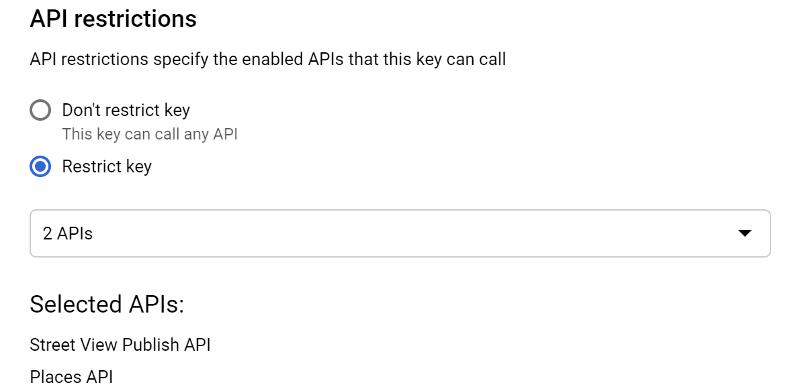

# Google Street View

### **Setup**

You will need a Google Cloud project to access the API's. Login to the [GCP Console](https://console.developers.google.com/).

The project name can be anything you want. It will only be visible to you in the GCP Console.

This app requires the following Google API's to work:

* [Street View Publish API](https://console.cloud.google.com/apis/library/streetviewpublish.googleapis.com) \(used to send photos to Street View\)
* [Place Autocomplete API ](https://developers.google.com/places/web-service/autocomplete)\(used to lookup placeid\)
* [Map Javascript API](https://developers.google.com/maps/documentation/javascript/overview) \(used for placeid\)


To enable these services, click each of the links above \(making sure the menu bar at the top shows the project you just created\) and select enable.

#### Create Oauth credentials

If this is your first time creating a project you might see the message:

> "To create an OAuth client ID, you must first set a product name on the consent screen."

Click the "Configure consent screen" button to do this.

The only field you need to fill in is "Application name". This name will be shown when you authenticate to allow the script to use your Google account to publish to Street View.

Once you have set the required consent information, select "API & Services" &gt; "Credentials".


Now select "Create credentials" &gt; "OAuth client ID"


Select Application type as "Web Application".

The call back URL \(redirect URI's\) should be set to `MTPW_DOMAIN/accounts/check-mtpu-gsv-oauth`

[See Map the Paths Web docs for more.](../../../mtp-web/developer-docs/api.md#mtpu-greater-than-google-street-view-greater-than-mtpw-greater-than-mtpu)

Enter a name for the credentials. This is helpful for tracking who these credentials are for.


If everything is successful, Google will generate a client ID and client secret. Make a note of these.

You can place your Google Oauth application information in the `.env` file once created.

```text
GOOGLE_CLIENT_ID=
GOOGLE_CLIENT_SECRET=
```

#### Create API key

Now go back to "API & Services" &gt; "Credentials" and select API key.



It's good practise to restrict the API's the key can be used with. At a minimum the following are required;

* Street View Publish API
* Places API
* Map Javascript API

You can place the generated API key in the `.env` file once created.

```text
GOOGLE_API_KEY=
```

### Workflow

#### 1. Validate imagery

Google Street View is based on the concept of Photos. It has no similar function to Sequences.

GSV accepts the following image projections:

* equirectangular

That is, if Sequence contains any flat \(2D\) images, user will not see Google Street View integration.

#### 2. User authenticates to Google


When a user tries to upload images to Google, they will grant the Google Oauth app access to act on their behalf \(see setup\).


When they click integrate/authenticate to Google at integrations step it will open a browser window for user to authorise your app.

If user clicks allow, the browser will redirect the user \(and token generated\) back to the MTP web \(using callback URL -- a dedicated MTPW endpoint for such tokens\).


Token is then automatically passed to MTP Uploader with user automatically redirected to MTP Uploader \(after clicking "open app"\) in browser.

[Google tokens do expire automatically](https://developers.google.com/identity/protocols/oauth2). As such, MTPDU does not store the token. This authentication is required every single time a user attempts to sync a new Sequence with GSV.

#### 3. Assign place to sequence

\[Place Search box image\]

User will be able to select a single location \(Google PlaceID\) for the sequence. This value will be assigned to all the photos in the sequence.

We use the [Places Autocomplete API](https://developers.google.com/places/web-service/autocomplete) which returns place information based on user input. As user enters location into a search box the API returns location information for selection.

We are concerned with the `place_id` value but also store the entire place record selection information in the final `sequence.json`.

#### 4. Request upload URL

[We've written an introduction to the Street View Publish API here](https://www.trekview.org/blog/2020/street-view-publish-api-quick-start-guide/). It is a useful guide in quickly understanding the fields that can be utilised with the API.

[Creating a photo requires three separate calls](https://developers.google.com/streetview/publish/first-app#uploading-a-photo). The first call will return an upload URL, which is used in the second call to upload the photo bytes. After the photo bytes are uploaded, the third call uploads the metadata of the photo and returns the photo ID.

```text
$ curl --request POST \
        --url 'https://streetviewpublish.googleapis.com/v1/photo:startUpload?key=YOUR_API_KEY' \
        --header 'Authorization: Bearer YOUR_ACCESS_TOKEN' \
        --header 'Content-Length: 0'
```

####  5. Upload the photo bytes to the Upload URL

```text
$ curl --request POST \
        --url 'UPLOAD_URL' \
        --upload-file 'PATH_TO_FILE' \
        --header 'Authorization: Bearer YOUR_ACCESS_TOKEN'
```

#### 6. Upload the metadata of the photo

[The photo.pose resource takes the following MTPDU values](https://developers.google.com/streetview/publish/reference/rest/v1/photo#pose).

* "captureTime" \(required\) &gt; GPSDateTime
* "latitude" \(required\) &gt; GPSLatitude
* "longitude" \(required\) &gt; GPSLongitude
* "altitude" \(required\) &gt; GPSAltitude
* "heading" \(optional\) &gt; heading \(for connection with positive connection.distance\_mtrs\)
* "pitch" \(optional\) &gt; pitch \(for connection with positive connection.distance\_mtrs\)

[The places resource takes the following values](https://developers.google.com/streetview/publish/reference/rest/v1/photo#place)

* "placeId" &gt; Place ID collected in previous step

```text
$ curl --request POST \
        --url 'https://streetviewpublish.googleapis.com/v1/photo?key=YOUR_API_KEY' \
        --header 'Authorization: Bearer YOUR_ACCESS_TOKEN' \
        --header 'Content-Type: application/json' \
        --data '{
                  "uploadReference":
                  {
                    "uploadUrl": "UPLOAD_URL"
                  },
                  "pose":
                   {
                     "heading": 105.0,
                     "latLngPair":
                     {
                       "latitude": 46.7512623,
                       "longitude": -121.9376983
                     }
                  },
                  "captureTime":
                  {
                    "seconds": 1483202694
                  },
                }'
```

#### 6. MTPW update

Google Street View information gets synced to Map the Paths web.

The process works in two parts:

**6.1 MTPW token / sequence id**

\*\*\*\*[MTPW authentication must be enabled for this integration for MTPW sync to work](../../../mtp-web/developer-docs/api.md#authorize). As such, app will already have MTPW token when user logged in when opening app.

[The app already has MTPW sequence information following create action of Sequence earlier in the process. ](map-the-paths-web.md)

**6.2 PUT Google Street View data**

\*\*\*\*[Send Google Street View info as PUT request to`/api/v1/sequence/import`](../../../mtp-web/developer-docs/api.md#create-sequence)

This can be sent using the PUT `/api/v1/sequence/import/MTP_SEQUENCE_ID` endpoint by including: `google_street_view=true`.

```text
curl --location --request PUT 'https://mtp.trekview.org/api/v1/sequence/import/jjff8djf-jkld87-kls889' \
--data-raw '{
    "google_street_view": TRUE
}'
```

[View the full MTPW API Docs here.](../../../mtp-web/developer-docs/api.md)

