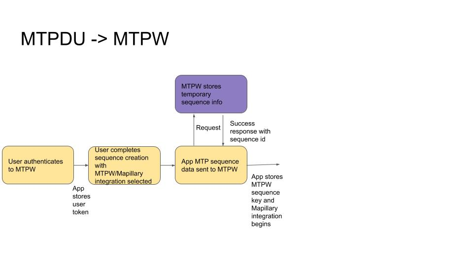

# Map the Paths Web

### **Setup**

If MTPW variables stored in `.env` file, all sequence data can be synced to MTPW.

If user selects MTPW integration, [Mapillary integration must also be selected by the user.](mapillary.md) When user selects either Mapillary or MTPW integration other option will be marked.

### **Workflow**



1. User authenticates to MTPW
   1. This is done on user opening app and key stored
2. User completes sequences creation
   1. With MTPW/Mapillary selected and authentication completed
3. App sends sequence data \(name, description, transport type and tags\) to MTPW. You'll notice it also sends `source=mtpdu`. This is so the origin of the request is known by MTPW. A MTPW sequence id is returned in the response.

```text
curl --location --request POST 'https://mtp.trekview.org/api/v1/sequence/create' \
--form 'name=<name>' \
--form 'description=<description>' \
--form 'transport_type=<transport_type>' \
--form 'tag=<tags>' \ 
--form 'source=mtpdu`
```

[View the full MTPW API Docs here.](../../../mtp-web/developer-docs/api.md)

