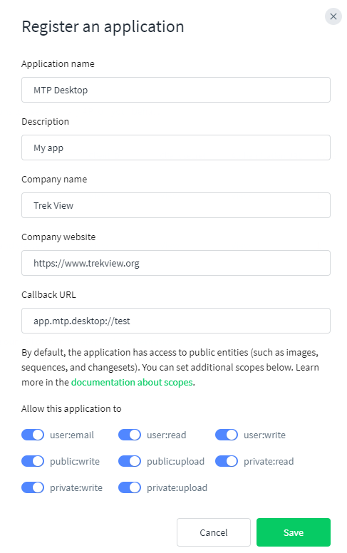
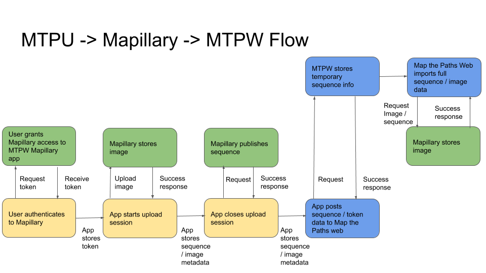

# Mapillary

### **Setup**

The Mapillary API lets you interact with Mapillary on the behalf of a user. [This is achieved by using OAuth 2.0](https://www.mapillary.com/developer/api-documentation/#oauth).

You need to create a Mapillary App. [Mapillary applications can be created here](https://www.mapillary.com/dashboard/developers).



Most options can be set as desired, but the callback user must match that specified in the `.env` file.

Enable all scopes \("allow this application to"\).

You can place your Mapillary application information in the `.env` file once created under the values:

```text
MAPILLARY_APP_ID=
MAPILLARY_SECRET=
MAPILLARY_REDIRECT_URI=
```

### **Upload images**

Mapillary is based on a very similar structure to Map the Paths with [Sequences](https://www.mapillary.com/developer/api-documentation/#sequences) and [Images](https://www.mapillary.com/developer/api-documentation/#images).

Sequences on Mapillary do not contain as much data \(e.g. names and descriptions\) as set on MTPDU.

Mapillary accepts the following image projections:

* flat
* equirectangular

Mapillary DOES NOT accept the following transport types

* Air
  * All child elements

[There are 4 steps to upload imagery to Mapillary](https://www.mapillary.com/developer/api-documentation/#uploading-imagery):

1. Prepare the imagery for uploading \(this is already done by the app in `ImageDescription` of images\) on MTPDU \([see here](../functions.md#21-2-imagedescription-json-object)\)
2. User authenticates to Mapillary
3. Create an upload session on Mapillary
4. Upload the imagery to the upload session on Mapillary
5. Publish the upload session on Mapillary

[For the purpose of testing, you can call the API with query parameter "dry run" to tell the service not publish the session for real \(note that you still won't reach the session after the call\). The session will fail after a few weeks](https://www.mapillary.com/developer/api-documentation/#publish-an-upload-session).

### **Store data**

Mapillary provides ongoing status of an [upload session](https://www.mapillary.com/developer/api-documentation/#the-open-upload-session-object), [including failures](https://www.mapillary.com/developer/api-documentation/#the-failed-upload-session-object).

When an image and sequence is created, the MTPDU stores the Mapillary info for it as shown in linked JSON examples for:

* [Sequences](https://www.mapillary.com/developer/api-documentation/#the-sequence-object)
* [Images](https://www.mapillary.com/developer/api-documentation/#the-image-object)

### **MTPW sync**



Map the Paths Sequence data and Mapillary sequence ID information gets synced to Map the Paths Web. 

[This is an automated version of the manual import sequence function in the MTPW UI. I strongly recommend testing how the manual process works here](https://mtp.trekview.org/sequence/import-sequence-list).

The process works in three parts:

1. Get MTPW token \(authentication must be enabled for this integration to work. As such, app will already have MTPW token when user logged in when opening app\)
2. Send Mapillary OAuth token to MTPW. In order for MTPW to communicate with Mapillary, it needs a copy of the Mapillary OAuth token. This can be sent using the `api/v1/mapillary/token/verify` endpoint using `mapillary_token` value.
3. Now the required MTPDU and Mapillary sequence data can be submitted to MTPW. This can be sent using the `/api/v1/sequence/import` endpoint by including: `sequence_key` \(Mapillary\), `name` \(MTPDU\), `description` \(MTPDU\), `transport_type` \(MTPDU\), `tags` \(MTPDU\)

[View the full MTPW API Docs here.](../../../mtp-web/api.md)

