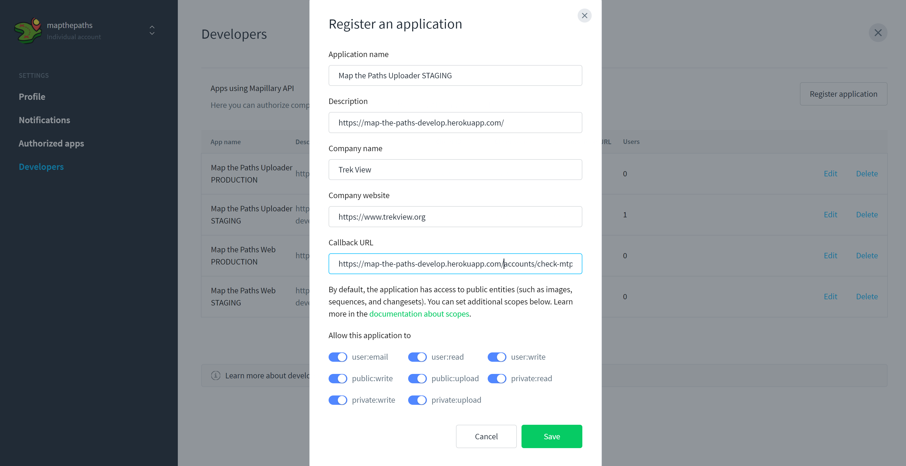
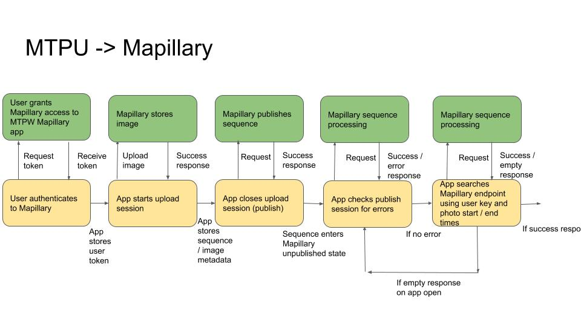
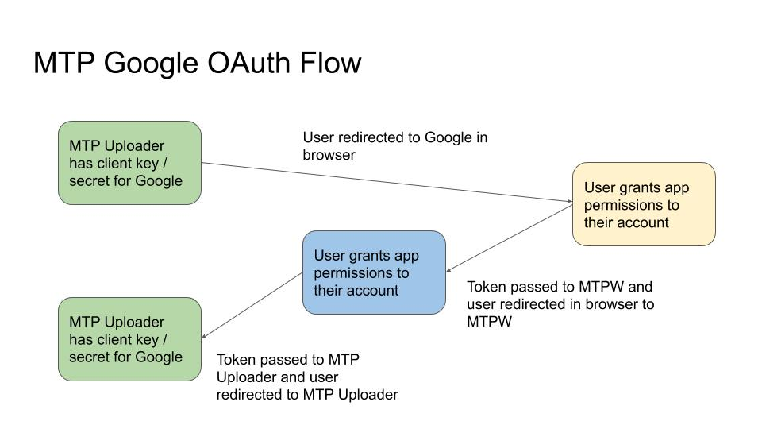
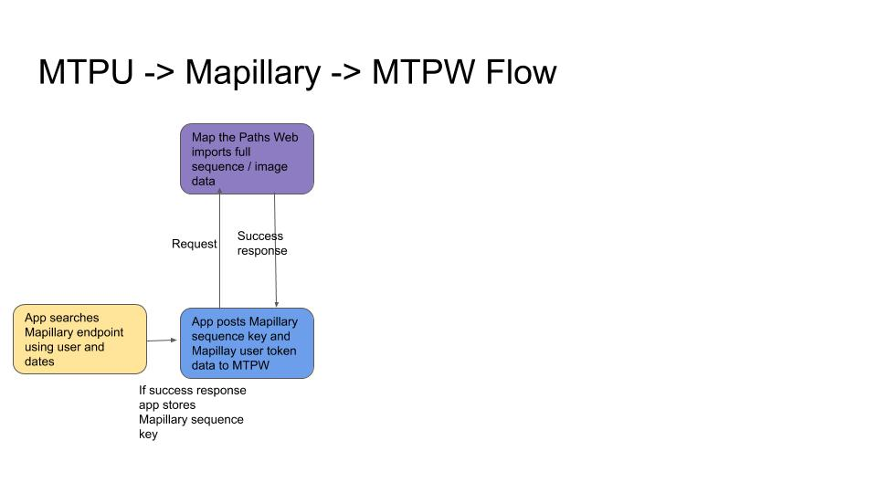

# Mapillary

### **Setup**

The Mapillary API lets you interact with Mapillary on the behalf of a user. [This is achieved by using OAuth 2.0](https://www.mapillary.com/developer/api-documentation/#oauth).

You need to create a Mapillary App. [Mapillary applications can be created here](https://www.mapillary.com/dashboard/developers).



You must set the following:

* Callback URL: `MTPW_DOMAIN/accounts/check-mtpu-mapillary-oauth`
* Allow this application to: `user:email`, `user:read`, `user:write`, `public:write`, `public:upload`

All other settings can be configured as you like.

Once you click save, the app will be assigned a client id and client secret. Add these to the .`env` file, along with the callback URL you just set. Here is a sample:

```text
MAPILLARY_APP_ID=ABCDEFGHIJK123
MAPILLARY_SECRET=ZYX987654321
MAPILLARY_REDIRECT_URI=https://map-the-paths-develop.herokuapp.com/accounts/check-mtpu-gsv-oauth
```

If any of these values are not present in `.env` file, user will not be able to view the Mapillary integration in UI.


I[f you are running your own Map the Paths web install, this Mapillary app needs to be different from the app created for the web app. This is because the redirect URL is different.](../../../mtp-web/developer-docs/install.md#mapillary-setup)


### \*\*\*\*

### **Workflow**

[There are 8 steps to upload imagery to Mapillary](https://www.mapillary.com/developer/api-documentation/#uploading-imagery) using MTPDU:

1. Validate imagery is OK for upload
2. Prepare the imagery for uploading
3. User authenticates to Mapillary
4. Create an upload session on Mapillary
5. Upload the imagery to the upload session on Mapillary
6. Publish the upload session on Mapillary \(by closing the upload session\)
7. Check for upload session for errors
8. Get Mapillary sequence key
9. MTPW Sync

[For the purpose of testing, you can call the API with query parameter "dry run" to tell the service not publish the session for real \(note that you still won't reach the session after the call\). The session will fail after a few weeks](https://www.mapillary.com/developer/api-documentation/#publish-an-upload-session).



### **1. Validate imagery \(todo\)**

Mapillary is based on a very similar structure to Map the Paths with [Sequences](https://www.mapillary.com/developer/api-documentation/#sequences) and [Images](https://www.mapillary.com/developer/api-documentation/#images).

Sequences on Mapillary do not contain as much data \(e.g. names and descriptions\) as set on MTPDU.

Mapillary accepts the following image projections:

* flat
* equirectangular

### 2. Prepare the imagery for uploading

This is already done by the app in `ImageDescription` of images\) on MTPDU \([see here](../functions.md#21-2-imagedescription-json-object)\).

### 3. User authenticates to Mapillary



When a user tries to upload images to Mapillary, they will grant the app access to act on their behalf \(see setup\).


When they click integrate/authenticate to Mapillary at integrations step it will open a browser window for user to authorise your app.

If user clicks allow, the browser will redirect the user \(and token generated\) back to the MTP web \(using callback URL -- a dedicated MTPW endpoint for such tokens\).


Token is then automatically passed to MTP Uploader with user automatically redirected to MTP Uploader \(after clicking "open app"\) in browser.

[Mapillary user tokens do not expire \(but user can revoke token\)](https://www.mapillary.com/developer/api-documentation/#oauth). As such, MTPDU stores the user token. If valid Mapillary token exists \(does not return unauthorised response\), user will not need to perform this step again. If no token or invalid token, user will need to perform this step again.

### 4. Create an upload session on Mapillary

[This process is described in the Mapillary API docs here.](https://www.mapillary.com/developer/api-documentation/#create-an-upload-session)

### 5. Upload the imagery to the upload session on Mapillary

[This process is described in the Mapillary API docs here.](https://www.mapillary.com/developer/api-documentation/#upload-imagery)

### 6. Publish the upload session on Mapillary \(by closing the upload session\)

[This process is described in the Mapillary API docs here.](https://www.mapillary.com/developer/api-documentation/#publish-an-upload-session)

### 7. Check for upload session for errors

Once an upload session gets published, you will not be able to find this session any more as it's moved for processing, unless it fails as a failed session.

[The app checks for a failed upload session using the get an upload session endpoint.](https://www.mapillary.com/developer/api-documentation/#get-an-upload-session)

This endpoint will only return failed sessions. If the sequence has not encountered any errors during the publishing workflow, you will not see it listed here.

If a failed upload session occurs, user will see a failed message \(either during upload process, or in sequence list\), and Mapillary integration will be removed from Sequence record. The user will then be able to re-upload the Sequences to Mapillary at a later time if they choose too.

### **8. Get Mapillary Sequence ID**

Unfortunately Mapillary does not provide the Sequence\_Key for an upload session in a response.

Therefore we need to do a bit of filtering with the Mapillary Sequences endpoint to get this info:

#### 8.1. Get upload user

After the user obtains the oAuth token, the app makes an API call to [`https://a.mapillary.com/v3/me`](https://a.mapillary.com/v3/me) with the users token to get the caller's `user_key`.

The `user_key` is then stored in app.

#### 8.2. Request user sequences

It is not possible to query the Mapillary API Search Sequence endpoint to find the Sequence Key of the Sequence uploaded:

* `user_key`: obtained in step one
* `start_time`: time of first photo in UTC uploaded in sequence \(`MAPCaptureTime`\)
* `end_time`: time of last photo in UTC uploaded in sequence \(`MAPCaptureTime`\)

We can now form a request: 

```text
curl "https://a.mapillary.com/v3/sequences?userkeys=USER_KEY&start_time=TIME&end_time=TIMEclient_id=<YOUR_CLIENT_ID>"
```

This will return a response like:

```text
{
  "type": "FeatureCollection",
  "features": [
    {
      "type": "Feature",
      "properties": {
        "camera_make": "Apple",
        "captured_at": "2016-03-14T13:44:53.860Z",
        "coordinateProperties": {
          "cas": [
            323.032,
            320.892,
            333.622,
            329.948
          ],
          "image_keys": [
            "LwrHXqFRN_pszCopTKHF_Q",
            "Aufjv2hdCKwg9LySWWVSwg",
            "QEVZ1tp-PmrwtqhSwdW9fQ",
            "G_SIwxNcioYeutZuA8Rurw"
          ]
        },
        "created_at": "2016-03-17T10:47:53.106Z",
        "key": "LMlIPUNhaj24h_q9v4ArNw",
        "pano": false,
        "user_key": "AGfe-07BEJX0-kxpu9J3rA",
        "username": "pierregeo"
      },
      "geometry": {
        "type": "LineString",
        "coordinates": [
          [
            16.432958,
            7.246497
          ],
          [
            16.432955,
            7.246567
          ],
          [
            16.432971,
            7.248372
          ],
          [
            16.432976,
            7.249027
          ]
        ]
      }
    }
  ]
}
```

Where `features.key` is the value of the Sequence Key we need to store.


Design decision: theoretically it is possible a user has two sequences in different places with start and end times in the specified range. However, it was decided because such a scenario is VERY unlikely, we accepted the risk of such collisions.


It can take up to 72 hours for a Sequences to be published, and thus a response to appear from this request.

If the app makes a query to this endpoint and an empty response is returned, the app keeps the sequence in Mapillary unpublished state.

When in this unpublished state, step 7 \(check for upload session errors\) is triggered every 5 minutes whilst app is open.

### **9. MTPW sync**



Mapillary sequence ID and user token information gets synced to Map the Paths Web[ alongside MTPDU sequence information uploaded during MTPW integration.](map-the-paths-web.md)

[This is an automated version of the manual import sequence function in the MTPW UI. I strongly recommend testing how the manual process works here](https://mtp.trekview.org/sequence/import-sequence-list).

Note, this is an overwrite action. If Mapillary sequence key already exists in MTPW DB, this record will be overwritten with new data submission.

The process works in two parts:

#### 9.1 MTPW token / sequence ID

[MTPW authentication must be enabled for this integration for MTPW sync to work](../../../mtp-web/developer-docs/api.md#authorize). As such, app will already have MTPW token when user logged in when opening app.

[The app already has MTPW sequence information following create action of Sequence earlier in the process. ](map-the-paths-web.md)

#### 9.2 PUT Mapillary data

[Send Mapillary sequences data as PUT request to`/api/v1/sequence/import`](../../../mtp-web/developer-docs/api.md#create-sequence)

This can be sent using the PUT `/api/v1/sequence/import/MTP_SEQUENCE_ID` endpoint by including: `mapillary_equence_key` and `mapillary_user_token`.

```text
curl --location --request PUT 'https://mtp.trekview.org/api/v1/sequence/import/jjff8djf-jkld87-kls889' \
--data-raw '{
    "mapillary_sequence_key": "<MAPILLARY_SEQ_KEY>",
    "mapillary_user_token": "<MAPILLARY_USER_TOKEN>"
}'
```

[View the full MTPW API Docs here.](../../../mtp-web/developer-docs/api.md)

