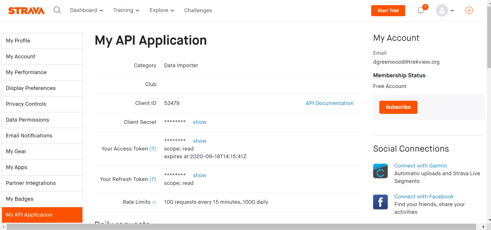

# Strava

### **Setup**

To authenticate users to Strava API \(get token for user by granting access\), [you must create a Strava Oauth app here](https://www.strava.com/settings/api).




This will give Client ID and secret.

You should set these values in the `.env` file as:

```text
STRAVA_CLIENT_ID=
STRAVA_CLIENT_SECRET=
```


[http://developers.strava.com/docs/authentication/\#requestingaccess](http://developers.strava.com/docs/authentication/#requestingaccess)

* `read`: read public segments, public routes, public profile data, public posts, public events, club feeds, and leaderboards
* `read_all`:read private routes, private segments, and private events for the user
* `profile:read_all`: read all profile information even if the user has set their profile visibility to Followers or Only You
* `profile:write`: update the user's weight and Functional Threshold Power \(FTP\), and access to star or unstar segments on their behalf
* `activity:read`: read the user's activity data for activities that are visible to Everyone and Followers, excluding privacy zone data
* `activity:read_all`: the same access as `activity:read`, plus privacy zone data and access to read the user's activities with visibility set to Only You
* `activity:write`: access to create manual activities and uploads, and access to edit any activities that are visible to the app, based on activity read access level


#### 6. MTPW update

Strava information gets synced to Map the Paths web.

The process works in two parts:

**6.1 MTPW token / sequence id**

\*\*\*\*[MTPW authentication must be enabled for this integration for MTPW sync to work](../../../mtp-web/developer-docs/api.md#authorize). As such, app will already have MTPW token when user logged in when opening app.

[The app already has MTPW sequence information following create action of Sequence earlier in the process. ](map-the-paths-web.md)

**6.2 PUT Strave data**

\*\*\*\*[Send Strava info as PUT request to`/api/v1/sequence/import`](../../../mtp-web/developer-docs/api.md#create-sequence)

This can be sent using the PUT `/api/v1/sequence/import/MTP_SEQUENCE_ID` endpoint by including: `strava=true`.

```text
curl --location --request PUT 'https://mtp.trekview.org/api/v1/sequence/import/jjff8djf-jkld87-kls889' \
--data-raw '{
    "strava": TRUE
}'
```

[View the full MTPW API Docs here.](../../../mtp-web/developer-docs/api.md)

