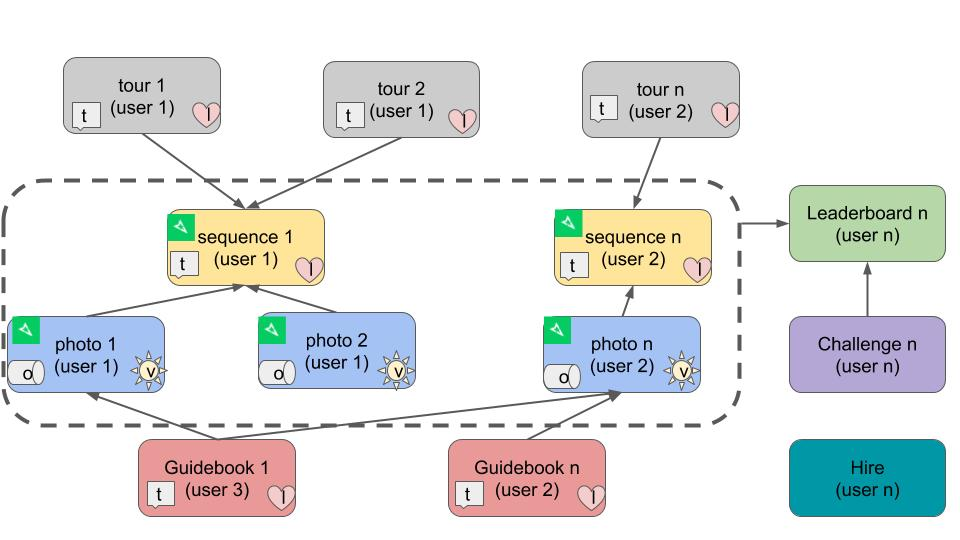

# Objects

### Relationships

### Core Concepts

#### 

#### 

\*\*\*\*

**Guidebooks**

Guidebooks are collections of any Mapillary photos with annotations to provide more information.

* Guidebook belongs to 1 user
* Guidebook has &gt;= 1 photos
  * Photo does not need to belong to imported MTP sequence. Can be any Mapillary image
* Guidebook has like count
  * Any user \(except owner can mark TRUE/FALSE\)
* Guidebook has &gt;=0 descriptive tags

**Leaderboard**

Leaderboards give users points based on their imagery synced to Map the Paths.

* Leaderboards have three types
  * Photos uploaded \(by user\): counts number of photos uploaded by user
  * Viewpoints received \(by user\): counts number of viewpoints users photos have received
  * Distance mapped \(by users\): counts the sum of kilometres covered by users Sequences
* Leaderboards have filters
  * By transport type \(parent/child\)
  * By camera make \(make/model\)
  * By date
* Leaderboards can be
  * Global: considers all photos and has filters any user can modify
  * Challenges: are fixed and related to settings defined when challenge was created \(no filters for user\)

**Challenges**

A challenge encourages user to capture photos in a defined location, and/or using a defined transport type,  and/or using a defined camera over a defined time period.

**Hire**

Any user can create a for hire listing to promote their paid street-level mapping services.

Hire listings are owned by user, but have no relationship to any other objects.

