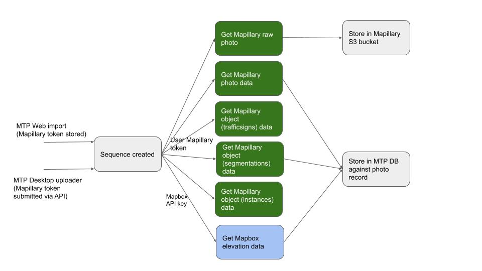

# Photos

### Overview

* Photo belongs to 1 user
* Photo belongs to 1 sequence
* Photo has viewpoint count
  * Any user \(except owner can mark TRUE/FALSE\)
* Photo has &gt;=0 object tags
  * Mapillary object tags
  * MTP object tags

### Photo creation workflow

Photos are created when a sequence is imported. All photos that belong to created sequence are added.

The sequence records contains all Mapillary photo keys needed for import. The Mapillary authentication in either MTP Web or the Desktop Uploader provides user Mapillary Tokens.



When a Sequence is created either using the MTP Web UI to import a sequence OR using the MTP Desktop Uploader the following happens:

#### Get Mapillary Raw photo

Using the Mapillary token a call is made to Mapillary for the photo image file using the following API call: 

```text
GET https://a.mapillary.com/v3/images/{image_key}/download_original
```

It is important the token belonging to user who created the Sequence is used, as this endpoint only allows owner access to the file.

Here is a sample API call:

```text
curl 'https://a.mapillary.com/v3/images/{image_key}/download_original?client_id={mtp_client_id}' -H 'authorization: Bearer {user_mapillary_token}' -o downloaded_image.jpg
```

Returned photos are stored in an S3 bucket, defined using the `AWS_S3_MAPILLARY_BUCKET` variable.

Photos are written to the bucket in the following structure: `/USERNAME/SEQUENCE_ID/PHOTO_N.jpg`

This bucket is not currently used by the app, but is implemented as a backup \(in case Mapillary ceases operation\).

#### Get Mapillary Photo data

[Mapillary photo data can be called using the Mapillary image endpoint.](https://www.mapillary.com/developer/api-documentation/#images)

Example request:

```text
curl "https://a.mapillary.com/v3/images?image_key=QKCxMqlOmNrHUoRTSrKBlg,cCkQ6Fd9Nigw5EYV8qWEIw&client_id=<YOUR_CLIENT_ID>"
```

Photo objects look like this:

```text
{
  "type": "FeatureCollection",
  "features": [
    {
      "type": "Feature",
      "properties": {
        "ca": 0,
        "camera_make": "",
        "camera_model": "",
        "captured_at": "1970-01-01T00:00:03.000Z",
        "key": "QKCxMqlOmNrHUoRTSrKBlg",
        "pano": true,
        "sequence_key": "KrZrFFEzBszRJTaBvK3aqw",
        "user_key": "T8XscpSs_3_W673i7WFQug",
        "username": "underhill",
        "organization_key": "GWPwbGxhu82M5HiAeeuduH",
        "private": false
      },
      "geometry": {
        "type": "Point",
        "coordinates": [
          -135.6759679,
          63.8655195
        ]
      }
    },
    {
      "type": "Feature",
      "properties": {
        "ca": 328.25359712230215,
        "camera_make": "LG Electronics",
        "camera_model": "LG-R105",
        "captured_at": "2020-07-18T14:14:36.555Z",
        "key": "cCkQ6Fd9Nigw5EYV8qWEIw",
        "pano": true,
        "sequence_key": "jxXeLZBG0oIMkEXnBZBATA",
        "user_key": "3gJd_jiCTawMEck87fRj_Q",
        "username": "jmmapiranger"
      },
      "geometry": {
        "type": "Point",
        "coordinates": [
          139.9049049,
          37.5309416
        ]
      }
    }
  ]
}
```

The app stores this data in the response for each photo.


Design decision:[ it is also possible to pass a `computer_coordinates` parameter to the request, to use the Mapillary calculated data according to this post](https://forum.mapillary.com/t/sfm-lat-lon-not-in-api-lat-lon-question/2881/23?u=trekview). However, because this is not documented in the official docs, we decided not to use it for fear it is removed.


We should pass the computed\_coordinates

#### Get Mapillary Photo object data

Object detections are grouped into the following layers by Mapillary:

1. `trafficsigns`: [Traffic signs](https://www.mapillary.com/developer/api-documentation/#traffic-signs).
2. `segmentations`: [Segmentations](https://www.mapillary.com/developer/api-documentation/#segmentations).
3. `instances`: [Point features](https://www.mapillary.com/developer/api-documentation/#points).

[Objects can be called using the object detection endpoint.](https://www.mapillary.com/developer/api-documentation/#search-object-detections)

As you can only call one object layer at a time, 3 API calls are required for each layer.

Example request \(trafficsigns\):

```text
curl "https://a.mapillary.com/v3/object_detections/trafficsigns?image_keys=QKCxMqlOmNrHUoRTSrKBlg,cCkQ6Fd9Nigw5EYV8qWEIw&per_page=2&client_id={mtp_client_id}
```

Object detections look like this:

```text
{
  "type": "FeatureCollection",
  "features": [
    {
      "type": "Feature",
      "properties": {
        "area": 0.0010786056518554688,
        "captured_at": "2020-02-03T10:22:50.000Z",
        "image_ca": 280.39,
        "image_key": "---wuOuOEBSdTC1FT_cOwA",
        "image_pano": false,
        "key": "QKCxMqlOmNrHUoRTSrKBlg",
        "score": 0.6509804129600525,
        "shape": {
          "type": "Polygon",
          "coordinates": [
            [
              [
                0.7685546875,
                0.6494140625
              ],
              [
                0.7939453125,
                0.6494140625
              ],
              [
                0.7939453125,
                0.69189453125
              ],
              [
                0.7685546875,
                0.69189453125
              ],
              [
                0.7685546875,
                0.6494140625
              ]
            ]
          ]
        },
        "value": "general--traffic-sign--g1"
      },
      "geometry": {
        "type": "Point",
        "coordinates": [
          13.010694722222222,
          55.59290138888889
        ]
      }
    },
    {
      "type": "Feature",
      "properties": {
        "area": 5.0067901611328125e-05,
        "captured_at": "2019-05-04T15:59:49.594Z",
        "image_ca": 46.29298472986875,
        "image_key": "--01194jdKj7vobUHT5DsV",
        "image_pano": false,
        "key": "cCkQ6Fd9Nigw5EYV8qWEIw",
        "score": 0.5098039507865906,
        "shape": {
          "type": "Polygon",
          "coordinates": [
            [
              [
                0.41357421875,
                0.5869140625
              ],
              [
                0.42041015625,
                0.5869140625
              ],
              [
                0.42041015625,
                0.59423828125
              ],
              [
                0.41357421875,
                0.59423828125
              ],
              [
                0.41357421875,
                0.5869140625
              ]
            ]
          ]
        },
        "value": "general--traffic-sign--g1"
      },
      "geometry": {
        "type": "Point",
        "coordinates": [
          13.028564168169062,
          55.609431307916076
        ]
      }
    }
  ]
}
```

The app stores this data in the response for each photo.

#### Get Mapillary Elevation data 

Mapillary decided not to expose elevation under `/v3/images` . Because mentioned that altitude is not relative to sea level but relative to an arbitrary reference and therefore it can not be use altitude globally. So its values is not useful in general. 

However, \(because we can't afford to query a global elevation model\), we use Mapillary altitude reported under the `/v3/images_computed.`

The endpoint can be queried in the same way as the image endpoint, but will return elevation too.

Example request:

```text
curl "https://a.mapillary.com/v3/images_computed?image_key=QKCxMqlOmNrHUoRTSrKBlg,cCkQ6Fd9Nigw5EYV8qWEIw&client_id=<YOUR_CLIENT_
```

The app stores only the elevation/altitude data in the response for each photo.


Design decision: We use the `/v3/images endpoint` NOT `/v3/images_computeted` for most image data because this the `/v3/images_computeted` endpoint is not documented in the official docs, and we decided not to use it for fear it is removed


####  

