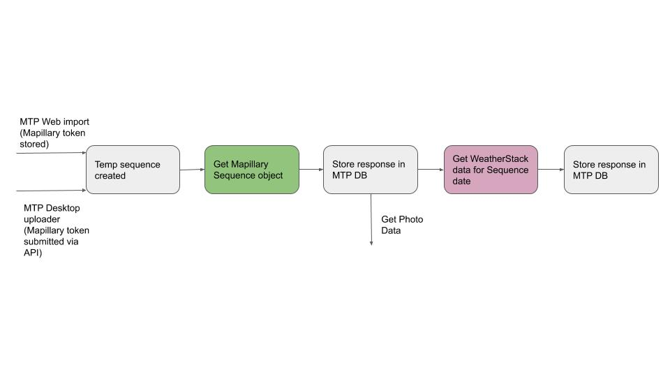

# Sequences

### Overview

* Sequence belongs to 1 user
* Sequence has &gt;= 1 photos
* Sequence has like count
  * Any user \(except owner can mark TRUE/FALSE\)
* Sequence can belong to 1 or more Tour owned by Sequence owner
* Sequence object has Map the Paths metadata:
  * A title
  * A description \(optional\)
  * A transport type \(parent / child\)
  * &gt;=0 descriptive tags
*  Sequence object has Mapillary metadata:
  * See Mapillary API in this document

### Preliminary Sequence creation workflow

Users can add Sequences to Map the Path in one of two ways:

#### 1. Using Map the Paths Desktop Uploader

[You can read how the Map the Paths Desktop Uploader posts a Sequence to the MTP Web API here.](../../../mtp-desktop-uploader/developer-docs/integrations/mapillary.md)

####  **2. By directly importing from Mapillary in MTP Web**

Users can choose 

1. User authenticates to the Mapillary and grants the client\_id access to their account \(obtained by creating app in Mapillary\)
2. App stores users Mapillary token to authenticate to Mapillary using their account
3. App queries Mapillary sequences belonging to user
4. User selects Mapillary sequences that belong to them and they want to import

### Sequence creation publish workflow



[Map the Paths imports all Mapillary Sequence data for sequence\_key user has selected for import using the /v3/sequences endpoint.](https://www.mapillary.com/developer/api-documentation/#sequences)

```text
{
  "type": "FeatureCollection",
  "features": [
    {
      "type": "Feature",
      "properties": {
        "camera_make": "Apple",
        "captured_at": "2016-03-14T13:44:53.860Z",
        "coordinateProperties": {
          "cas": [
            323.032,
            320.892,
            333.622,
            329.948
          ],
          "image_keys": [
            "LwrHXqFRN_pszCopTKHF_Q",
            "Aufjv2hdCKwg9LySWWVSwg",
            "QEVZ1tp-PmrwtqhSwdW9fQ",
            "G_SIwxNcioYeutZuA8Rurw"
          ]
        },
        "created_at": "2016-03-17T10:47:53.106Z",
        "key": "LMlIPUNhaj24h_q9v4ArNw",
        "pano": false,
        "user_key": "AGfe-07BEJX0-kxpu9J3rA",
        "username": "pierregeo"
      },
      "geometry": {
        "type": "LineString",
        "coordinates": [
          [
            16.432958,
            7.246497
          ],
          [
            16.432955,
            7.246567
          ],
          [
            16.432971,
            7.248372
          ],
          [
            16.432976,
            7.249027
          ]
        ]
      }
    }
  ]
}
```

The app stores this data in the response for each Sequence.

Once a sequence record has been created in MTP 2 things happen:

* [The Photo creation process begins](photos.md#photo-creation-workflow)
* The weather for Sequence captured\_at date is quiered against WeatherStack API

#### Weather data \(WeatherStack API\)

We use the [WeatherStack's Historic API](https://weatherstack.com/documentation) to enrich Sequence with a weather report from the same day the sequences was `captured_at`.

To query the WeatherStack API you need an API key. You can generate one on the WeatherStack site and store it under the `WEATHERSTACK_API_KEY` variable.

The historic API currently requires a paid plan to access.

```text
http://api.weatherstack.com/current
    ? access_key = WEATHERSTACK_API_KEY
    & query = LAT,LON OF FIRST IMAGE IN SEQUENCE
    & historical_date = DATE OF SEQUENCE CAPTURED_AT
    & hourly = 1
    & units = m
```

This will give a sample response like:

```text
{
    "request": {
        "type": "City",
        "query": "40.7831,-73.9712",
        "language": "en",
        "unit": "m"
    },
    "location": {
        "name": "New York",
        "country": "United States of America",
        "region": "New York",
        "lat": "40.714",
        "lon": "-74.006",
        "timezone_id": "America/New_York",
        "localtime": "2019-09-07 10:05",
        "localtime_epoch": 1567850700,
        "utc_offset": "-4.0"
    },
    "current": {
        "observation_time": "02:05 PM",
        "temperature": 15,
        "weather_code": 113,
        "weather_icons": [
            "https://assets.weatherstack.com/images/wsymbols01_png_64/wsymbol_0001_sunny.png"
        ],
        "weather_descriptions": [
            "Sunny"
        ],
        "wind_speed": 0,
        "wind_degree": 0,
        "wind_dir": "N",
        "pressure": 1011,
        "precip": 0,
        "humidity": 78,
        "cloudcover": 0,
        "feelslike": 15,
        "uv_index": 5,
        "visibility": 16
    },
    "historical": {
        "2008-07-01": {
            "date": "2008-07-01",
            "date_epoch": 1214870400,
            "astro": {
                "sunrise": "05:29 AM",
                "sunset": "08:31 PM",
                "moonrise": "03:24 AM",
                "moonset": "07:37 PM",
                "moon_phase": "Waning Crescent",
                "moon_illumination": 4
            },
            "mintemp": 0,
            "maxtemp": 0,
            "avgtemp": 19,
            "totalsnow": 0,
            "sunhour": 14.5,
            "uv_index": 4,
            "hourly": [
                {
                    "time": "0",
                    "temperature": 27,
                    "wind_speed": 7,
                    "wind_degree": 201,
                    "wind_dir": "SSW",
                    "weather_code": 113,
                    "weather_icons": [
                        "https://assets.weatherstack.com/images/wsymbols01_png_64/wsymbol_0001_sunny.png"
                    ],
                    "weather_descriptions": [
                        "Sunny"
                    ],
                    "precip": 1.8,
                    "humidity": 80,
                    "visibility": 9,
                    "pressure": 1011,
                    "cloudcover": 15,
                    "heatindex": 25,
                    "dewpoint": 20,
                    "windchill": 24,
                    "windgust": 11,
                    "feelslike": 25,
                    "chanceofrain": 0,
                    "chanceofremdry": 0,
                    "chanceofwindy": 0,
                    "chanceofovercast": 0,
                    "chanceofsunshine": 0,
                    "chanceoffrost": 0,
                    "chanceofhightemp": 0,
                    "chanceoffog": 0,
                    "chanceofsnow": 0,
                    "chanceofthunder": 0,
                    "uv_index": 6
                },
                {   "time": "300", ...   },
                {   "time": "600", ...   },
                // 6 more items
            ]
        }
    }
}
```

With the `hourly = 1` parameter specified, you will get potentially 24 hours of `"historical": {` results. The result with the closest time to the sequence `capture_at` time date is used.

Only one historical record is stored against the Sequence record. Put another way, we only consider the weather when the Sequence was started.


Design decision: because most Sequence are &lt; 1 hour in duration and WeatherStack data has an hourly resolution, we do not see the point of querying the API for each image


### **Tours**

 Tours are collections of Sequences that have some relationship curated by Sequence owner. 

* Tour belongs to 1 user
* Tour has &gt;= 1 sequences
  * Sequence must belong to tour creator
* Tour has like count
  * Any user \(except owner can mark TRUE/FALSE\)
* Tour has
  * A title
  * A description \(optional\)
  * &gt;=0 descriptive tags

