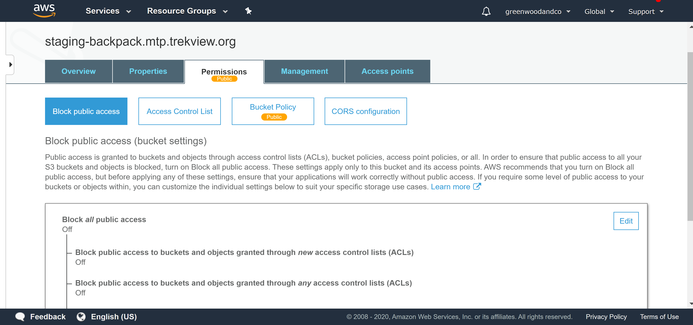
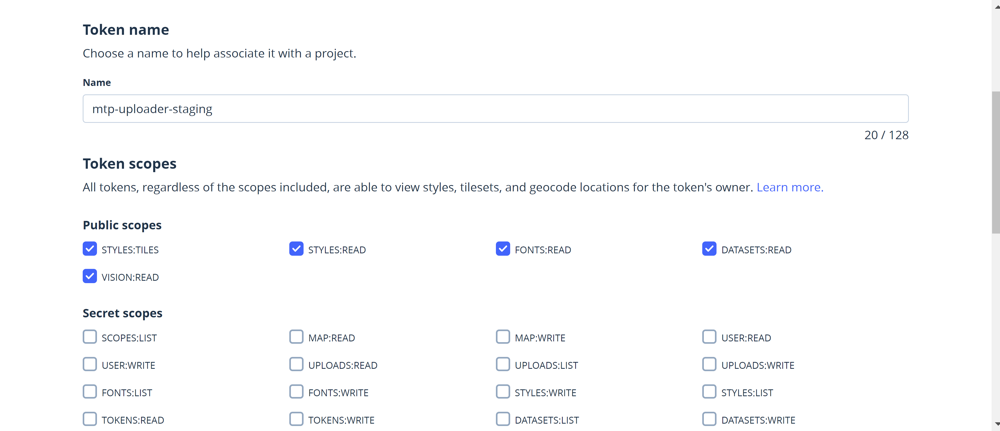

# Install


[This documentation is designed for developers. If you want to use the Map the Path online web application, go here.](https://mtp.trekview.org/)


## Cloud Services

### AWS Setup

In production we use AWS; IAM, S3, Route53, Certificate Manager and CloudFront

#### S3 Create Buckets

The app uses two buckets:

1. `AWS_S3_BUCKET` For static files \(e.g CSS, avatars, local scripts\)
2. `AWS_S3_MAPILLARY_BUCKET` For photo files \(downloaded from Mapillary\)

You need to create two buckets for this purpose.

The `AWS_S3_BUCKET` need to be public so that viewers can load files.

To do this go to the bucket and click permissions. Make sure "Block all public access" is set to false.



Under bucket policy set the following, making sure to replace the `"Resource"` value with you bucket name. Do not replace the trailing `/*`

```text
{
    "Version": "2012-10-17",
    "Statement": [
        {
            "Sid": "PublicReadGetObject",
            "Effect": "Allow",
            "Principal": "*",
            "Action": "s3:GetObject",
            "Resource": "arn:aws:s3:::staging-backpack.mtp.trekview.org/*"
        }
    ]
}
```

Make sure to now set them in the app environmental variables as:

```text
AWS_S3_BUCKET
AWS_S3_MAPILLARY_BUCKET
```

#### Cloudfront

We use Cloudfront to resolve the bucket domains.

For example, making [`https://s3.eu-west-2.amazonaws.com/staging-backpack.mtp.trekview.org`](https://s3.eu-west-2.amazonaws.com/staging-backpack.mtp.trekview.org) resolve to [`http://staging-backpack.mtp.trekview.org`](http://staging-backpack.mtp.trekview.org/)\`\`

First you'll need an SSL certificate.[ We use free certificates from AWS Certificate Manger that can be created here.](https://eu-west-2.console.aws.amazon.com/acm/home?)

Now create a new CloudFront Web distribution.

Set the origin domain name and path to your S3 bucket from the dropdown list.

Set the CNAME to the URL of the bucket you want to use \(e.g. ``[`http://staging-backpack.mtp.trekview.org`](http://staging-backpack.mtp.trekview.org/)\)

Select the certificate created previously and force HTTPS request.

Save the distribution.

As we use Route53 \(DNS\) from AWS, we can get AWS to update the DNS with the CNAME data. If you use another DNS service, you'll need to add a CNAME record manually like so:

`CNAME` [`staging-backpack.mtp.trekview.org`](http://staging-backpack.mtp.trekview.org/) `CLOUDFRONT_DOMAIN`

The CNAME chosen  \(e.g.[http://staging-backpack.mtp.trekview.org](http://staging-backpack.mtp.trekview.org/)\) should then be added to the following app environment variable.

```text
AWS_S3_BUCKET_CNAME
```

#### IAM

[For security we can now create some users/groups/policies in AWS IAM to restrict who can interact with the buckets.](https://console.aws.amazon.com/iam/home)

**Create a new policy**

Create a custom policy we can use to restrict bucket access.

```text
{
    "Version": "2012-10-17",
    "Statement": [
        {
            "Sid": "VisualEditor0",
            "Effect": "Allow",
            "Action": [
                "s3:GetAccessPoint",
                "s3:PutAccountPublicAccessBlock",
                "s3:GetAccountPublicAccessBlock",
                "s3:ListAllMyBuckets",
                "s3:ListAccessPoints",
                "s3:ListJobs",
                "s3:CreateJob",
                "s3:HeadBucket"
            ],
            "Resource": "*"
        },
        {
            "Sid": "VisualEditor1",
            "Effect": "Allow",
            "Action": "s3:*",
            "Resource": [
                "arn:aws:s3:::staging-mapillary-images.mtp.trekview.org",
                "arn:aws:s3:::staging-backpack.mtp.trekview.org",
                "arn:aws:s3:*:*:accesspoint/*",
                "arn:aws:s3:::*/*",
                "arn:aws:s3:*:*:job/*"
            ]
        }
    ]
}
```

Here you can see the two buckets under the "Resource" object.

```text
            "Resource": [
                "arn:aws:s3:::staging-mapillary-images.mtp.trekview.org",
                "arn:aws:s3:::staging-backpack.mtp.trekview.org",
```

Replace these with your own bucket names and create the policy.

#### Create new group

We will assign the new policy to a group.

Create a new group and attach the newly created policy.

#### Create new user

Now we can create the user.

Create the user, making sure to attach them to the newly created group.

At the end you will receive an access key and secret key. These values can be used for the following app environment variables:

```text
AWS_ACCESS_KEY
AWS_SECRET_KEY
```

### Mailgun Setup


We use Mailgun. Any other SMTP provider \(Sendgrid, Mandrill, etc\) should work without issue.


Setup Mailgun \(they will guide you through requiements\) and create an SMTP user.

Once done you'll need to add the following to the app environment variables:

* `MAILGUN_PRIVATE_API_KEY`
* `SMTP_HOSTNAME`
* `SMTP_PASSWORD`
* `SMTP_PORT`
* `SMTP_USER`

You also need to set the following to the app environment variables related to emails:

* `SMTP_REPLY_TO` : this is added in case your `SMTP_USER` does not resolve to a real mailbox. When we send emails we use this as the `Reply-To` header value. [Here's a good explanation why](https://stackoverflow.com/questions/1235534/what-is-the-behavior-difference-between-return-path-reply-to-and-from) .
* `SMTP_FROM_NAME` : used as the display name in email clients when users receive emails

### Mailerlite Setup

When users sign up, we give them the opportunity to explicitly opt in to our email list.

[We user Mailerlite.](https://www.mailerlite.com/)

You'll first need to create a new list/group in Mailerlite and then grab you api key/token.

These values should then be added as the app environment variables:

```text
MAILERLITE_GROUPID
MAILERLITE_TOKEN
```

### Mapillary Setup

#### MTPW Web app

[The web app uses the Mapillary API for a variety of features.](https://www.mapillary.com/developer/api-documentation/)

[You'll first need to create a Mapillary OAuth app here.](https://www.mapillary.com/dashboard/developers)

It is important when creating the app you set the following two values:

1. Callback URL: `DOMAIN`[`/accounts/check-mapillary-oauth`](https://map-the-paths-develop.herokuapp.com/accounts/check-mapillary-oauth) ``\(e.g. [https://map-the-paths-develop.herokuapp.com/accounts/check-mapillary-oauth](https://map-the-paths-develop.herokuapp.com/accounts/check-mapillary-oauth)\)
2. Scopes: Mark all

When the app is created, you will get a Client ID, Client secret and authentication URL.

These values should then be added as the app environment variables:

```text
MAPILLARY_AUTHENTICATION_URL
MAPILLARY_CLIENT_ID
MAPILLARY_CLIENT_SECRET
```

#### MTP Desktop uploader

If you want the app to be able to work with the MTPDU, you must also add the Mapillary Oauth app values used by the uploader. Without setting these, the API will not work.

These values should then be added as the app environment variables:

```text
MTP_DESKTOP_UPLOADER_CLIENT_ID
MTP_DESKTOP_UPLOADER_CLIENT_SECRET
```

### Mapbox Setup

For maps in the app we use Mapbox.

Mapbox is a paid service but has a generous free tier.

When you've created an account, [you need to create an access token here.](https://account.mapbox.com/access-tokens/c)

You should allow the default scopes



It's a good idea to restrict the token to request from the domain you will be using.

Once created, the api key should then be added as the app environment variable:

```text
MAPBOX_TOKEN
```

### Font Awesome setup

We use Font Awesome free icons in the app.

You'll need to create a Font Awesome kit in order to use these icons.

[Sign up to create an account and a kit here.](https://fontawesome.com/start)

Once created, the kit id should then be added as the app environment variable:

```text
FONT_AWESOME_KIT
```

### Google Analytics setup

We use Google Analytics to track usage. You need to create a new property on Google Analytics to generate a site id \(e.g. `UA-123456789-0`\)

Once created, the id should then be added as the app environment variable:

```text
GOOGLE_ANALYTICS
```

## Deploying locally

### Clone

```text
git clone https://github.com/trek-view/mtp-web.git
```

### Set up environment

#### Prerequisites

* PostgreSql 10.0+
* Postgis package
* Python 3.5+

#### Set variables

Set `DJANGO_SETTINGS_MODULE` to `config.settings_local` in `manage.py:`

```text
os.environ.setdefault('DJANGO_SETTINGS_MODULE', 'config.settings_local')
```

Fill following values in `config/setting_local.py`

```text
DATABASES = {
    'default': {
        'ENGINE': 'django.contrib.gis.db.backends.postgis',
        'NAME': '',
        'USER': '',
        'PASSWORD': '',
        'HOST': 'localhost',
        'PORT': '5432'
    }
}

# SECURITY WARNING: keep the secret key used in production secret!
SECRET_KEY = ''

MAPBOX_PUBLISH_TOKEN = 'your_mapbox_token'

MAILERLIST_API_KEY = 'your_maillist_api_key'

MAILERLIST_GROUP_ID = 'your_maillist_aroup_id'

GOOGLE_ANALYTICS = 'your_google_analysis_key'

# EMAIL_BACKEND = "django.core.mail.backends.filebased.EmailBackend"
EMAIL_FILE_PATH = os.path.join(BASE_DIR, "sent_emails")

# SMTP settings
# EMAIL_BACKEND = 'django.core.mail.backends.smtp.EmailBackend'
EMAIL_HOST = 'smtp_host'
DEFAULT_FROM_EMAIL = 'xxx@your_domain'
EMAIL_HOST_USER = 'xxx@your_domain'
EMAIL_HOST_PASSWORD = 'smtp_password'
EMAIL_USE_TLS = True
EMAIL_PORT = 587

SMTP_REPLY_TO = DEFAULT_FROM_EMAIL
```

If you want to enable two auth for admin users, please add this in config/urls.py

```text
admin.site.__class__ = AdminSiteOTPRequiredMixinRedirSetup
```

#### Build

The following command will build Map the Paths.

```text
pip install -r requirements.txt
python manage.py makemigrations
python manage.py migrate
python manage.py createsuperuser
python manage.py runserver
```

## Deploying to Digital Ocean

We host Map the Paths on Digital Ocean droplets. The following steps should work on any cloud Iaas.

**1. Create ssh key and add to DO**

`$ ssh-keygen -f KEYNAME -C noname`

**2. Choose droplet deploy with SSH key**

Setup a droplet, using Ubuntu 20.04 \(LTS\) x64.

**3. Connect to your droplet**

`$ ssh -i "YOURPRIVATEKEYNAME" ROOT@SERVERIP`

**4. Update packages**

`$ sudo apt-get update`

**5. Add more users**

`$ sudo adduser USERNAME`

**6. Make user sudo if needed**

`sudo usermod -aG sudo USERNAME`

**7. Add users public key**

`su USERNAME`

`mkdir ~/.ssh/`

`cd`

`nano .ssh/authorized_keys`

Now paste in their public key.

**8. Harden security**

`nano /etc/ssh/sshd_config`

Then set the following

```text
PermitRootLogin no
StrictModes yes
PubkeyAuthentication yes
PasswordAuthentication no
```

**9. Now restart SSH**

`sudo service ssh restart`

_10. Set up Firewall rules_

All non-essential ports should be blocked using ufw.

First switch off ufw \(to ensure we don't kick ourselves off server when blocking all ports\): `sudo ufw disable`

Then block all ports: `sudo ufw default deny`

The open required ports:

* SSH `sudo ufw allow 22`
* HTTP `sudo ufw allow 80`
* HTTPS `sudo ufw allow 443`
* \`\`

To ensure config is saved when changed install iptables-persistent: 

`sudo apt-get install iptables-persistent`

And save iptables set above

`sudo service netfilter-persistent save`

Then turn on ufw to enable rules: `sudo ufw enable`

**11. Deploy app to server**



**12. Configure app**

Described in setup environment above.

**13. Setup SSL**

**For security, all request should be served using SSL \(using Let's Encrypt\).**

`sudo apt-get install letsencrypt`

Before you do anything else, find your Django `settings.py` file and add these lines:

`sudo nano settings.py`

```text
# URL that handles encryption files
ENCRYPT_URL = '/.well-known/'
ENCRYPT_ROOT = os.path.join(STATIC_ROOT, '.well-known')
```

Now, find your `urls.py` file and add this:

`sudo nano urls.py`

```text
from django.conf import settings
from django.conf.urls.static import static

urlpatterns = [
    # ... the rest of your URLconf goes here ...
] + static(settings.ENCRYPT_URL, document_root=settings.ENCRYPT_ROOT)
```

TODO for webserver

\`\`

**I won't detail all steps her**

\*\*\*\*[https://ramonmelo.me/en/blog/regarding-ssl/](https://ramonmelo.me/en/blog/regarding-ssl/)


## Deploying to Heroku \(no longer supported\)

To deploy on your own Heroku environment.

1. Create a new app on Heroku
2. Connect your Github repository to the created app \(and make sure correct branch is connected if using auto deployment\)
3. Set `DJANGO_SETTINGS_MODULE` to `config.settings_heroku` in `manage.py` and `config/wsgi.py`.

```text
os.environ.setdefault('DJANGO_SETTINGS_MODULE', 'config.settings_heroku')
```

4. Make sure Heroku environmental vars are set to match those listed in `config/setting_local.py`

* ACCESS\_TOKEN\_LIFETIME
* BASE\_URL
* BUILD\_WITH\_GEO\_LIBRARIES
* DATABASE\_URL
* DEBUG\_COLLECTSTATIC
* DISABLE\_COLLECTSTATIC
* LD\_LIBRARY\_PATH
* REDIS\_URL
* REFRESH\_TOKEN\_LIFETIME
* SECRET\_KEY
* SITE\_ID

5. Push code to Github

Quick install and run server using cli on heroku:

```text
heroku git:remote -a your_heroku_app
git push heroku [git_branch:]master
heroku run python manage.py migrate [-a your_heroku_app]
heroku run python manage.py collectstatic --noinput [-a your_heroku_app]
heroku run python manage.py createsuperuser [-a your_heroku_app]
```

Run following command to check logs.

```text
heroku logs --tail [-a your_heroku_app]
```

## 

