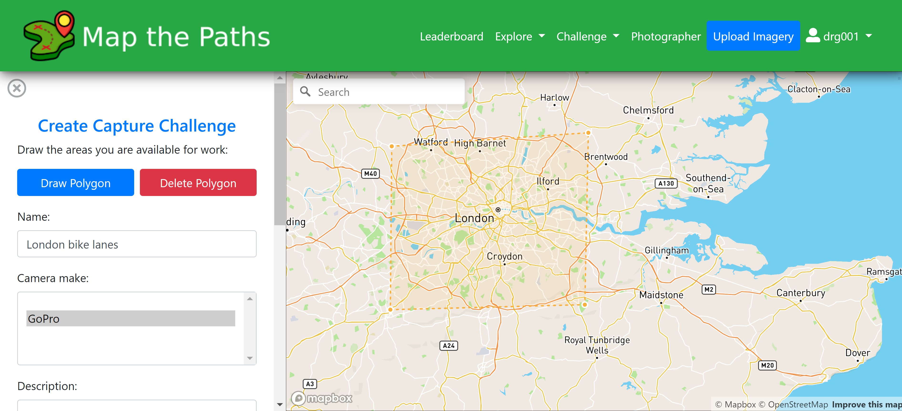
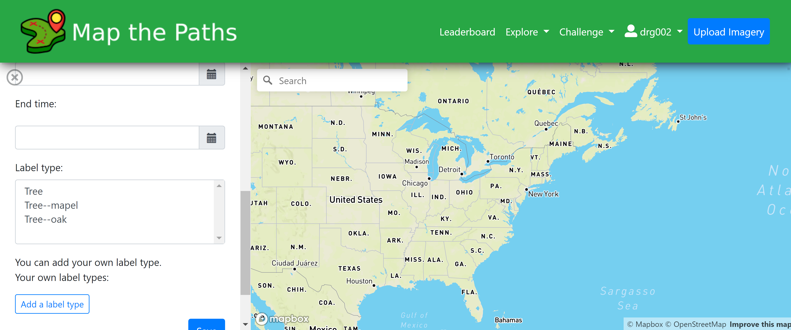
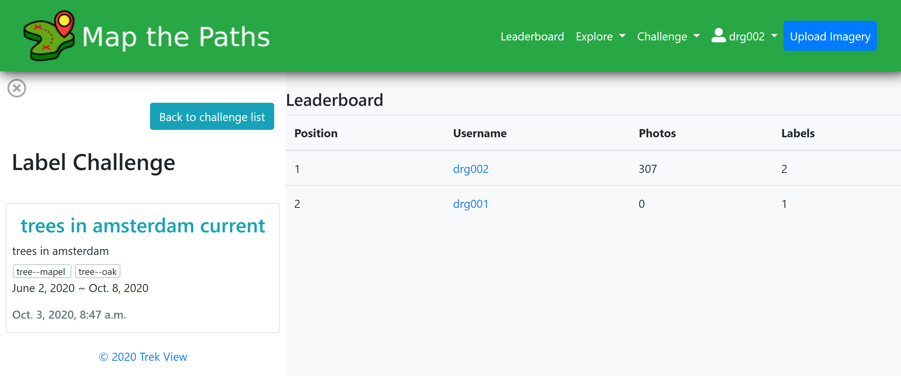

# Challenges

### About

Challenges encourage other users to help improve the map.

There are two types of challenges

* Image capture: creating and uploading sequences that meet Challenge criteria
* Image labelling: tagging images that meet Challenge criteria

#### Image capture challenge

An image capture challenge encourages street-level photographers to capture photos in a defined location, and/or using a defined transport type,  and/or using a defined camera over a defined time period.

For example, an image capture challenge might be set to map all London bike lanes by bike in 2020. Every sequence/image on Map the Paths that falls within the challenge criteria will earn the user that uploaded them points against that Challenge.

#### Image label challenge

An image labelling challenge encourages Map the Paths users to help improve automatic detection in images.

For example, an image labelling challenge might be to identify Oak Trees in southern England. Every sequence/image on Map the Paths that falls within the challenge criteria will earn users points for every Oak tree they identify.

### Create

#### Capture challenges

To create a capture challenge you must add a:

* Name: a descriptive name about your challenge
* Description: the finer details about your challenge
* Challenge area: the areas imagery should captured. Only sequences inside this area will score points on the challenge leader board
* Camera type: the manufacturer of camera that should be used. Only sequences with this type will score points on the challenge leader board
* Transport type: the transport type that should be used. Only sequences with this type will score points on the challenge leader board
* Start / end time: the dates imagery collection will count towards scoring points.

#### Labelling challenges

To create a capture challenge you must add a:

* Name: a descriptive name about your challenge
* Description: the finer details about your challenge
* Challenge area: the areas imagery should captured. Only sequences inside this area will score points on the challenge leader board
* Labels: choose from existing labels or add your own.
* Start / end time: the dates when imagery labels submitted that will count towards scoring points.

### Take Part

#### Capture challenges

All you need to do is upload/import sequences that matches the challenge criteria \(area, camera, and transport type\).

Once uploaded/imported you'll be automatically entered into the challenge and your name will appear on the challenge leaderboard.

#### Label challenges

All you need to do is label an image with a label that matches the challenge criteria \(area, and label\).

Once you've added your first label that matches the criteria you'll be automatically entered into the challenge and your name will appear on the challenge leaderboard.

