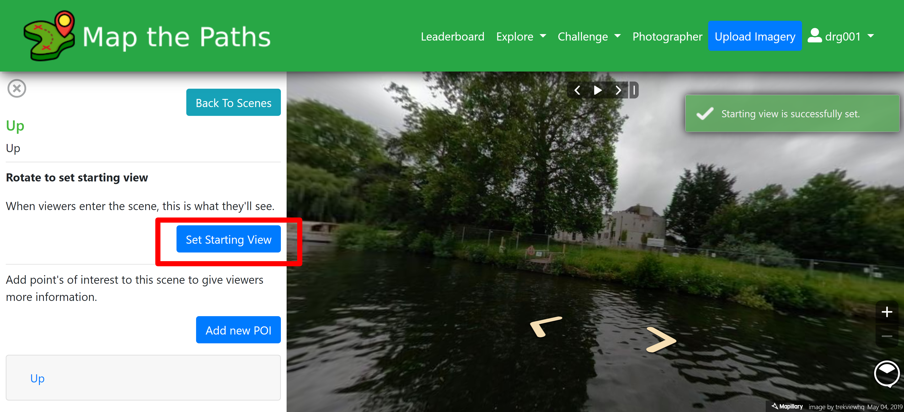

# Guidebooks

### About

Guidebooks are collections of individual street-level photos with some relationship. 

Guidebooks have Scenes \(Photos\) and Point of Interest \(highlighted points in the Photo\).

Guidebooks can be created using any Photo that exist on Mapillary.

Guidebooks can cover any topic you want. For example, Guidebook might include scenes of historic city monuments, each annotated with Points of Interest to explain more about their history.

### Create

To create new Guidebooks:

#### **1. Select create**

Go the Guidebooks page when logged in and select the button "Create Guidebook".

#### **2.** Add Guidebook metadata

You need to add some information to create a Guidebook. This data makes it easier for you to manage your Guidebooks on Map the Paths and for other users to discover them.

The following categories can be selected:

* Architecture
* Art
* Culture and Humanity
* Current Events
* History
* Nature
* Places and Scenes
* Sports and Fitness
* Transport
* Travel and Leisure

You can add a tag that contains any number or letter, or the "-" character.

#### **3.** Add your first Scene

To add the first Scene \(photo\) to the Tour, click the "Add Scene" button.

You can use the place search to find the first location you want to save as a Scene.

When zoomed in closer to ground level, you will see point plotted on the map to represent imagery that exists. You can click any point on the map and it will show the photo for the point you've clicked. You can maximise the image at any point to take a closer look.

When you've found the Photo you want to use for the Scene, fill in the name and description and click the "Save New Scene" button.

Your Guidebook will be automatically published after the first Scene is added.

#### **4.** Add a Point of Interest \(POI\)

You can now add POI's to your Scene. POI's are optional. POI's are designed to give users more location specific information about each Scene.

To create a POI, click the "Add New POI" button when in the Scene edit view.

Select a point in the image where the information icon will be displayed to a user visiting that scene.

When you are happy with the positioning of the POI icon, add a name, description and classification. 

The following classifications are available:

* Geography
* History
* General Interest
* Object
* Other

Then click "Save".

You can add multiple POI's to any Scene.

#### **5. Set** starting view

If your image is a 360 image, you can set a starting view that will be shown when user loads the scene. This will be useful if the default view does not face the part of the image you want to illustrate.

When you've found the desired starting view, select "Set Starting View".

#### **6.** Add more scenes

You can continue adding Scenes in the same way to your Guidebook.

#### 7. Manage Guidebook

Once published, your Guidebook will can now be discovered by users in the Guidebook search.

  
When a Guidebook is clicked, it will enter the Guidebook view allowing a user to browse through the content of the Guidebook.

If you are logged in, and own the Guidebook, you can click the edit button to make changes to the Guidebook information, the Scenes and POI's in the Guidebook, or unpublish it so that others cannot view it.

