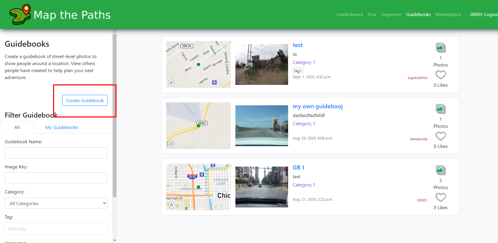
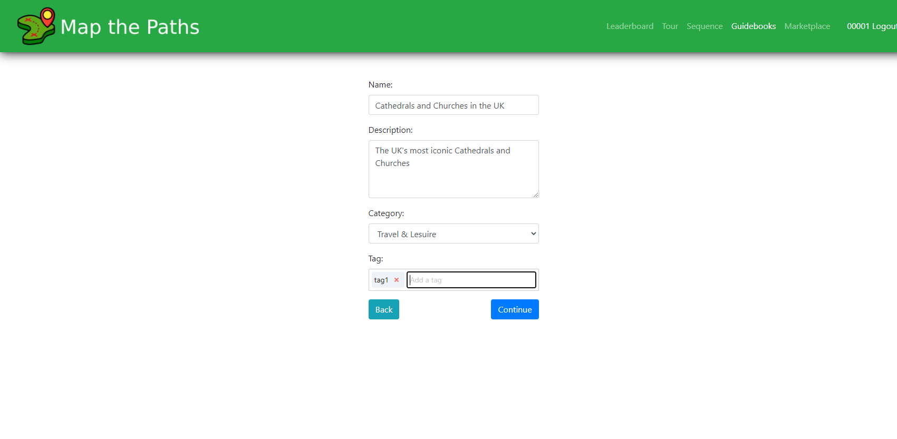
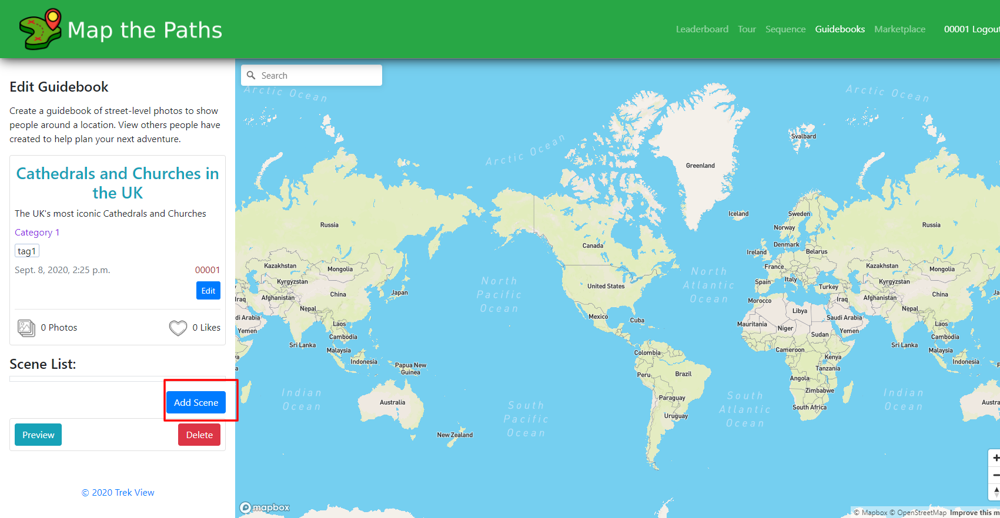
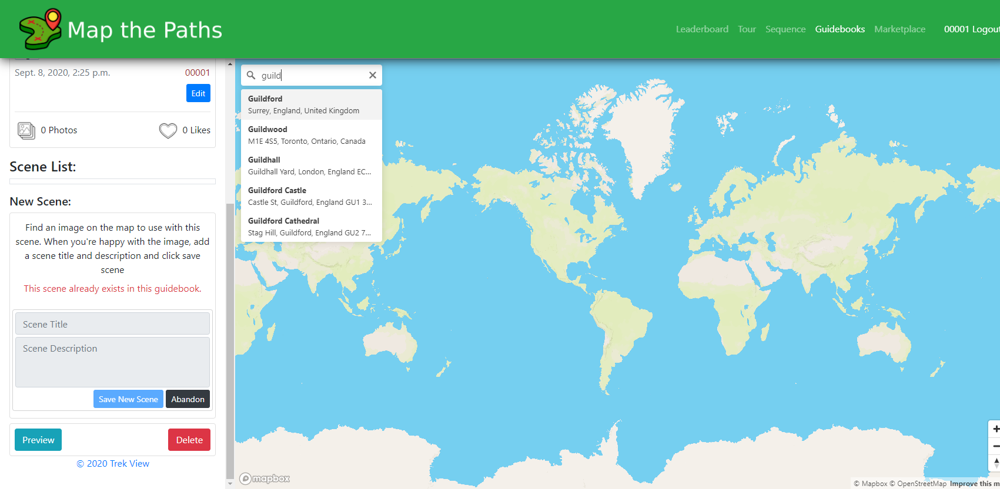
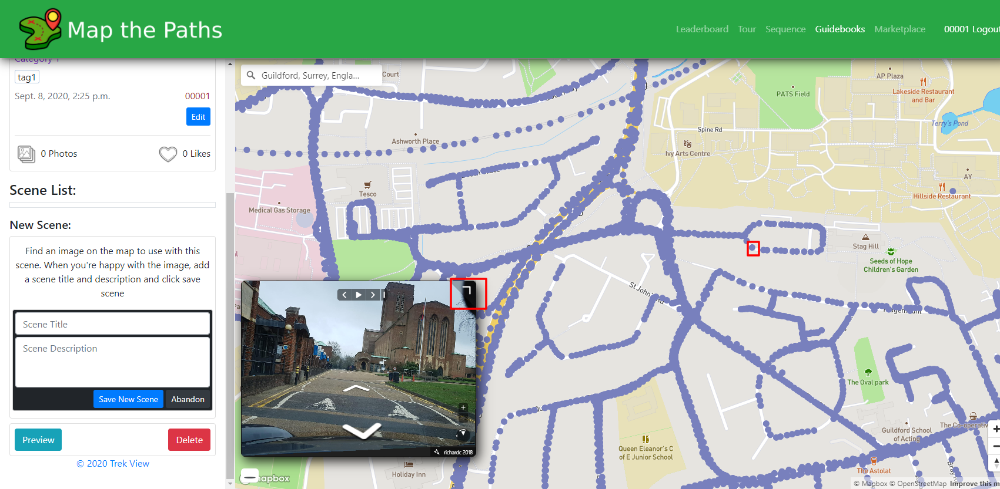
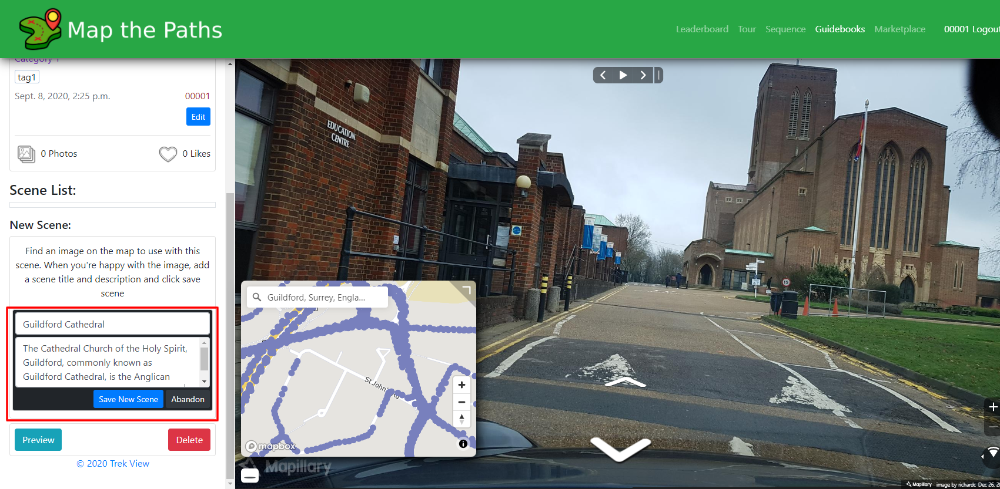
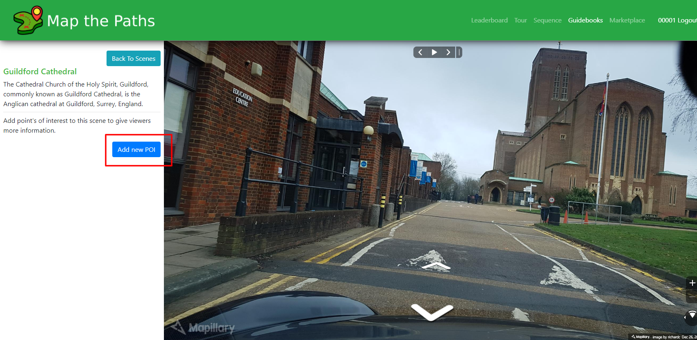
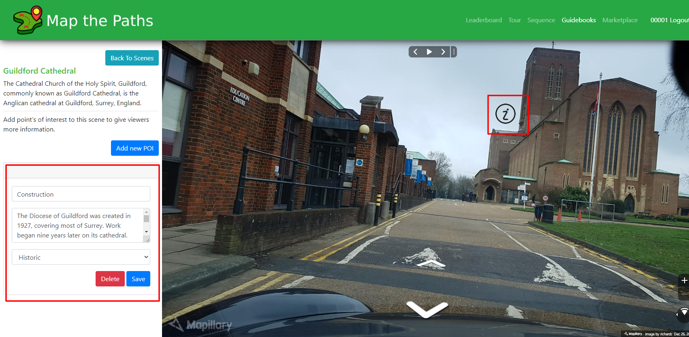
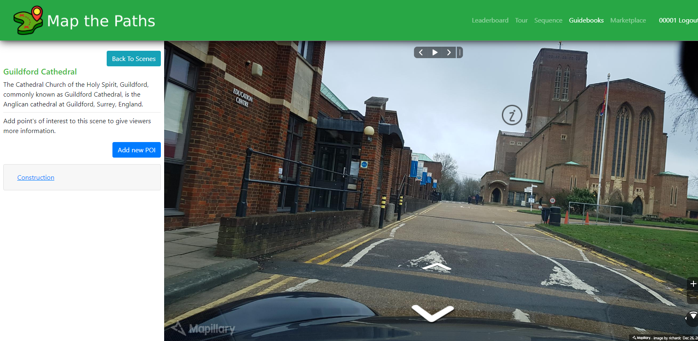
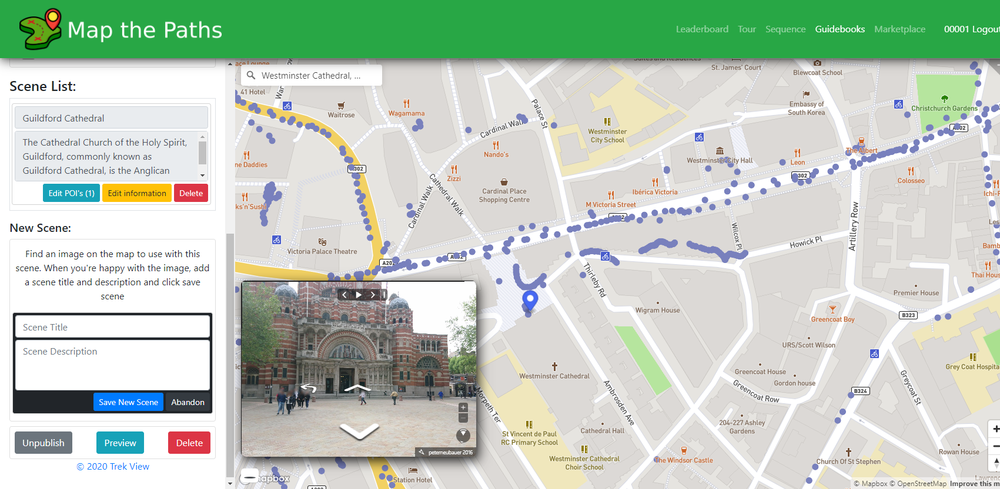

# Curate

### About

Guidebooks are collections of individual street-level photos with some relationship. 

Guidebooks have Scenes \(Photos\) and Point of Interest \(highlighted points in the Photo\).

Guidebooks can be created using any Photo that exist on Mapillary.

Guidebooks can cover any topic you want. For example, Guidebook might include scenes of historic city monuments, each annotated with Points of Interest to explain more about their history.

### Create

To create new Guidebooks:

#### **1. Select create**

Go the Guidebooks page when logged in and select the button "Create Guidebook".

#### **2.** Add Guidebook metadata

You need to add some information to create a Guidebook. This data makes it easier for you to manage your Guidebooks on Map the Paths and for other users to discover them.

#### **3.** Add your first Scene

To add the first Scene \(photo\) to the Tour, click the "Add Scene" button.

You can use the place search to find the first location you want to save as a Scene.

When zoomed in closer to ground level, you will see point plotted on the map to represent imagery that exists. You can click any point on the map and it will show the photo for the point you've clicked. You can maximise the image at any point to take a closer look.

When you've found the Photo you want to use for the Scene, fill in the name and description and click the "Save New Scene" button.

#### **4.** Add a Point of Interest \(POI\)

You can now add POI's to your Scene. POI's are optional. POI's are designed to give users more location specific information about each Scene.

To create a POI, click the "Add New POI" button when in the Scene edit view.

Select a point in the image where the information icon will be displayed to a user visiting that scene.

When you are happy with the positioning of the POI icon, add a name, description and classification. Then click "Save".

You can add multiple POI's to any Scene.

#### **5.** Add more scenes

You can continue adding Scenes in the same way to your Guidebook until you're ready to publish.

#### 4. Manage Guidebook

Guidebook select "Publish Now".

Until you select "Publish Now", other users will not be able to see your Tour.

