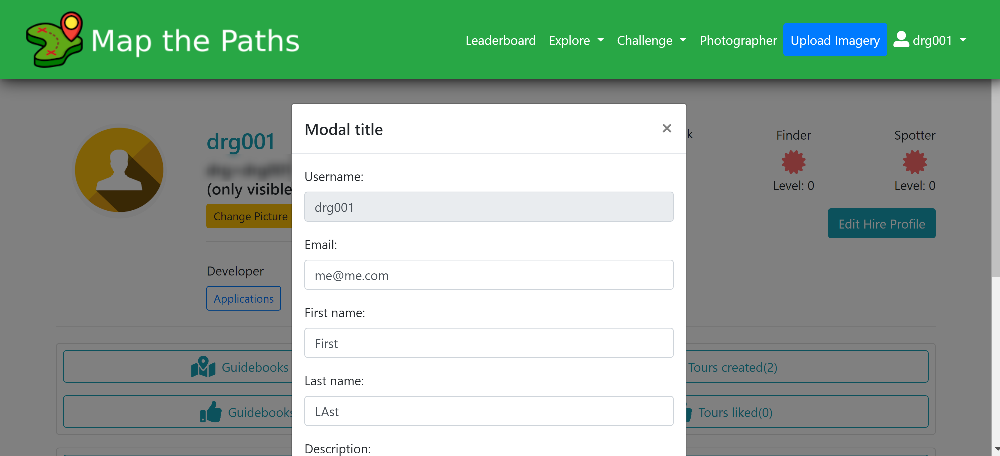

# Profile

## Details

You can modify your profile page by including:

* First name
* Last name
* Description / about
* Website
* Profile photo

To modify your profile, click the edit/change picture button on your profile page.


It is not possible to change your username.



We never share your email with other Map the Paths users in the application interface. The only time your email is shared is when another user attempts to contact you via your hiring listing \(if it exists\)


## Hiring

If you offer professional virtual tour creation services it is possible to mark your profile as available "For Hire".

To do this, simply navigate to your profile page, and click "Create hiring profile".

You can add the following values to your profile, and update them at anytime:

* Area / location: draw polygons on the map in places you're willing to work
* Business Details \(will be shown in the listing\)
  * Your name
  * Your businesses name
  * Your businesses website
  * A description of what you do
* Capture type: the types of captures you have equipment for, one or more:
  * 360 Photos
  * 2D Photos
  * LiDaR
  * Other
* Capture method: how you capture the images, one or more:
  * Drone
  * Car
  * Foot
  * Bike
  * Other
* Image quality: the highest quality images you are able to capture:
  * Low \(up to 4k\)
  * Medium \(4k - 11k\)
  * High \(11k +\)

Once published, other users will be able to find your hiring listing via your profile or [through the photographer search feature.](https://www.mapthepaths.com/hire/list/)

## Badges

You can earn badges on Map the Paths based on your activity.

Here is a full list of badges currently available:

### Mapper Badge

Based on the number of images you've uploaded in your Sequences:

| Level | Requirement \(uploaded images\) |
| :--- | :--- |
| 1 | 1 |
| 2 | 10 |
| 3 | 100 |
| 4 | 1,000 |
| 5 | 10,000 |
| 6 | 100,000 |
| 7 | 1,000,000 |

### Guide Badge

Based on the number of Guidebooks you've created \(and are published\):

| Level | Requirement \(Guidebooks created\) |
| :--- | :--- |
| 1 | 1 |
| 2 | 5 |
| 3 | 10 |
| 4 | 20 |
| 5 | 50 |
| 6 | 100 |
| 7 | 200 |

### Finder Badge

Based on the number of Viewpoints your images have received:

| Level | Requirement \(viewpoints received\) |
| :--- | :--- |
| 1 | 1 |
| 2 | 10 |
| 3 | 50 |
| 4 | 100 |
| 5 | 200 |
| 6 | 500 |
| 7 | 1,000 |

### Spotter Badge

Based on the number of Labels you've added to images:

| Level | Requirement \(labels added\) |
| :--- | :--- |
| 1 | 1 |
| 2 | 10 |
| 3 | 100 |
| 4 | 1,000 |
| 5 | 10,000 |
| 6 | 100,000 |
| 7 | 1,000,000 |

## Developer

For those building integrations with Map the Paths you can also create an oAuth application on your profile page.

[For more information, please see the developer docs.](../developer-docs/)

