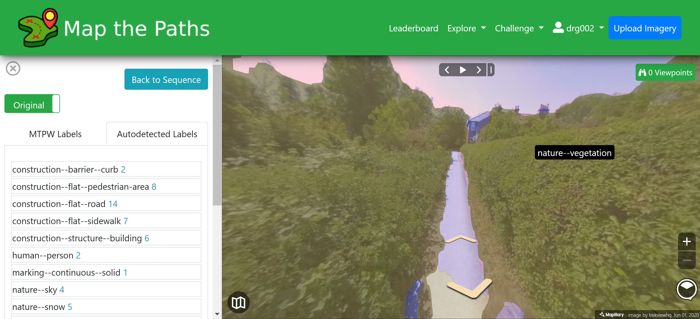

# Photos

### About

Every sequence consists of two or more images \(Photos\). Photos are either 2D or 360 imported from Mapillary.

Photos can only belong to one sequence.

It is useful to have a human searchable record of what is inside an image. For example; show me all photos that contain cars.

Photos therefore have 4 types of associated metadata

* Sequence data: the sequence information for the sequence they belong to
* Image data: such as capture time, camera type, etc.
* Image labels
  * **Manual**: labels added to images by MTPW users \(image specific\)
  * **Auto detected**: computer vision technology automatically detects objects depicted in images, such as buildings, cars, pedestrians, bicycle racks, and much more. This is based on a method called semantic segmentation—an algorithm is trained to detect and assign a category label to every pixel in the image. \(image specific\)
  * **Map features**: Map features represent objects that are detected in images and placed in a 3D space. Using computer vision, we recognise objects captured in images \(available as auto detections\). Next, by reconstructing the 3D scene structure, we can position these objects on the map as map features \(location specific\)

### Sequence data

[Because each image belongs to a sequence, it inherits the sequence data.](create.md)

### Image data

This data is essentially the metadata added to the image when it was taken and/or processed \(things like location, elevation, camera type, etc.\).

### Image labels

When in Photo view, you will be able to see image labels in an image. When viewing a photo you can toggle the original/detection tab to enter detection mode.

#### Auto detected

You'll see all detections that have been found in the image.

**Map features**

Will show the location of the objects detected in physical space on the map \(latitude and longitude\).

#### Manual

You might notice objects that have not been labelled in an image. In which case, you can add them yourself.

You can also add your own labels by tracing around the object you wish to label in the image.

Manual labels are the equivalent of autodetected labels as they only have a location in the image not in physical space \(like map features\).

#### How to manually label an object

To do this:

1. In detection mode select "Add label"
2. Select the label you want to add
   1. If you don't see the type of label you want to add, [you can create a Challenge](../challenges.md). This will not only add the label to our label database, but also encourage others to use this label across all Map the Paths imagery
3. Draw the outline of the object using the polygon creation tool. Once the Polygon has been drawn, your label will be added

