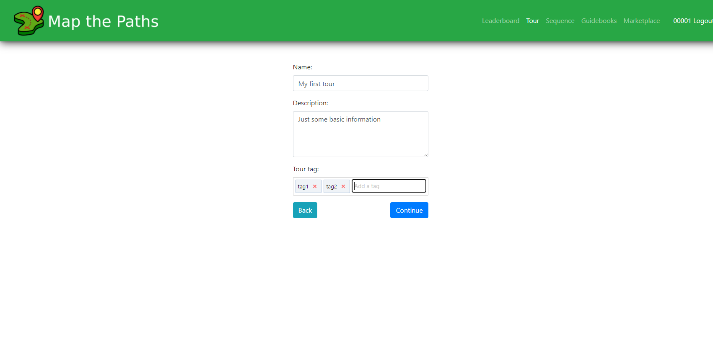
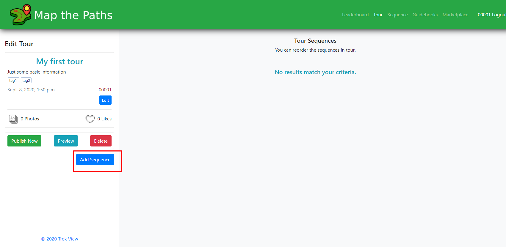
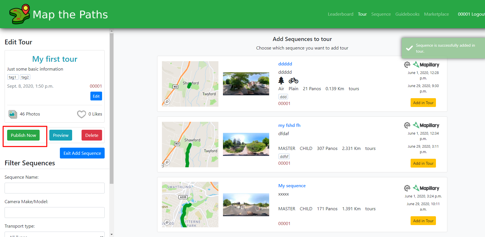
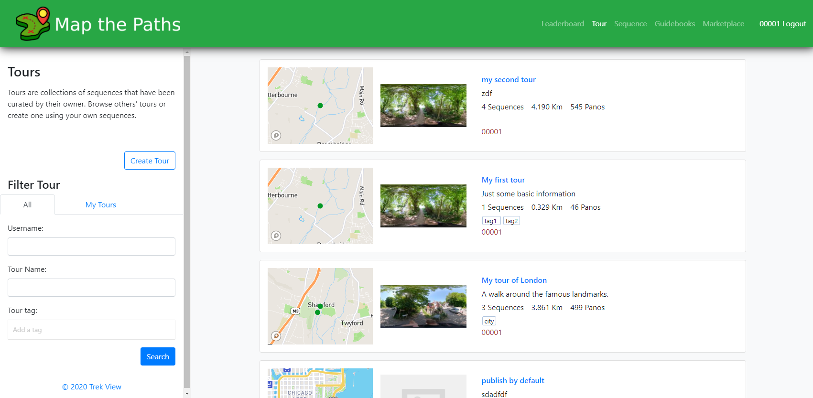
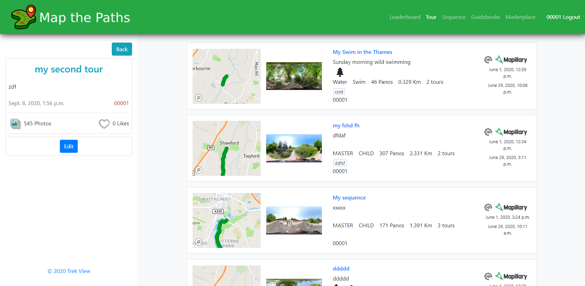

# Tours

### About

Depending on how you shot your imagery, it is likely you will have a number of sequences with some relationship to a location.

For example, if you take photos of a local park as a series of individual time lapses \(e.g. one timelapse per path in the path\). In this situation, the Sequences are all related and it makes sense to group them together under the name of the park. This is what you can do with Tours

### Create

To create new tours.

#### **1 Select create**

Go the Tours page when logged in and select the button "Create Tour".

#### 2. Add Tour metadata

You need to add some information to create a Tour. This data makes it easier for you to manage your Tours on Map the Paths and for other users to discover them.

#### 3. Add Sequences to Tour

To add the Sequences to the Tour, click the "Add Sequence" button.

[You can only add Sequences you've created and imported to Map the Paths.](create.md)

Filter sequences shown using the filter in the left sidebar.

To add a Sequence to this Tour, click the "Add to Tour" button.

A Sequence can be added to a Tour once. A Sequence can be added to multiple Tours.

You can continue to add Sequences to the Tour.

When you've added all Sequences you want included in the Tour, select "Publish Now".

Until you select "Publish Now", other users will not be able to see your Tour.

#### 4. Manage Tour

Once published, your Tour will can now be discovered by users in the Tour search.

When a Tour is clicked, it will show a list of Sequences that belong to it.

If you are logged in, and own the Tour, you can click the edit button to make changes to the Tour information, or the Sequences that belong to that Tour.

