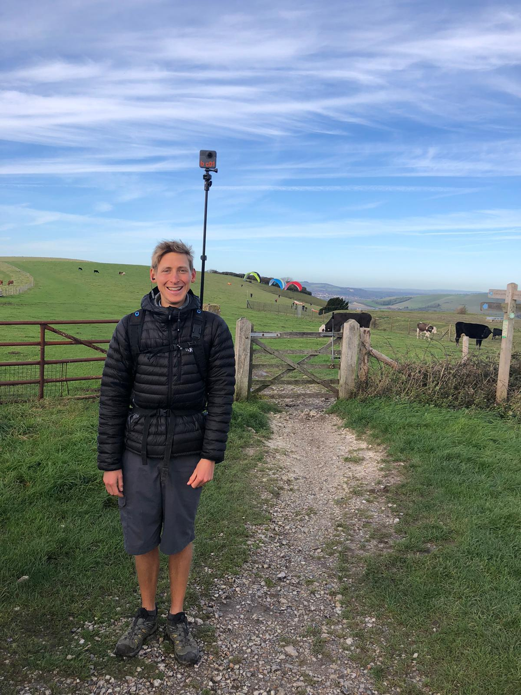

# Shooting


[**The Trek Pack v2 is now available \(June 2020\). Click here for more information.**](https://app.gitbook.com/@dgreenwood-trekview/s/trek-view/~/drafts/-MGZS3QJdkKSR1bua7Ub/trek-pack/v2)**​**​


### Perform a test run

If not extended, extend the monopod so that you can just reach the start / stop button on the camera.

Turn the camera on, ensuring it is in the correct shooting mode and setting \(usually time-lapse\).

Put the pack on, and secure the straps to keep it from moving around too much. These straps also help compensate for the load of the pack too.

Reach up and press the start button \(red circle outline\) and walk around your house / garden / neighbourhood.

After a few minutes, stop the filming by pressing the start button again. The camera should show a number \(the number of photos taken on your test tour. Note, this number is cumulative and will show number of photos taken in total\).

Turn off the camera, and remove one of the micro SD cards. Place the microSD card in the microSD card USB reader and insert into your computer You should see either the front or back images \(depending on which SD card you’ve inserted\).

Eject the microSD card USB reader from your computer, replace the SD Card in the camera, and do the same thing with the second microSD card.

If everything appears to be working correctly, it’s time to shoot.

### Before you Leave the House

This part is written from bitter experience -- turning up, excited to start filming, and realising I’ve forgotten something.

Now I perform the following checks before leaving home:

1. Are the batteries fully charged and is one in the camera? Have you packed a spare?
2. Do the MicroSD cards have enough free space for everything you plan to shoot? Are they both in the camera?
3. Is the monopod in/on the pack \(including GoPro mounts and screws\)?
4. Have you enabled GPS mode?
5. Is time-lapse mode on the correct interval for the type of transport you will use to shoot?
6. What is the weather like? Have you checked the best source of weather information available for the location?

You should also consider safety. Have you got the right gear for the environment? Are you prepared for changes in the weather? Are you going out with a friend? Does someone at home know your plans? Have you packed water and food?

### Capturing a Tour

Put on the pack, set the mode to time-lapse \(ensuring the settings are correct\), make sure that the GPS is locked on \(the GPS pin icon is a solid colour\), and start press the red button.

You don’t need any more instructions -- you’re now an expert on the Trek Pack. Though here are some recommendations based on personal experience:

* When shooting, try not to move your torso around too much, but remember to enjoy the environment around you too.
* The only other thing I would recommend is, when shooting in timelapse capture a series of photos in batches. Stop/start the time-lapse every 10 or 15 minutes. This means photos can processed in batches, rather than one single series, which can be useful for reasons I’ll describe in part 4 \(hint: software crashes\).
* Be prepared for questions. Many people will be intrigued by your Trek Pack. We encourage Trekkers to share what they’re doing with others, and why. Many people will, rightly, be concerned about their privacy. Be prepared to tell them how your photos will be used.
* Make sure you comply with local laws around public photography too. Generally don’t shoot on private property or around children, but make sure you know what is and isn’t allowed beforehand.

