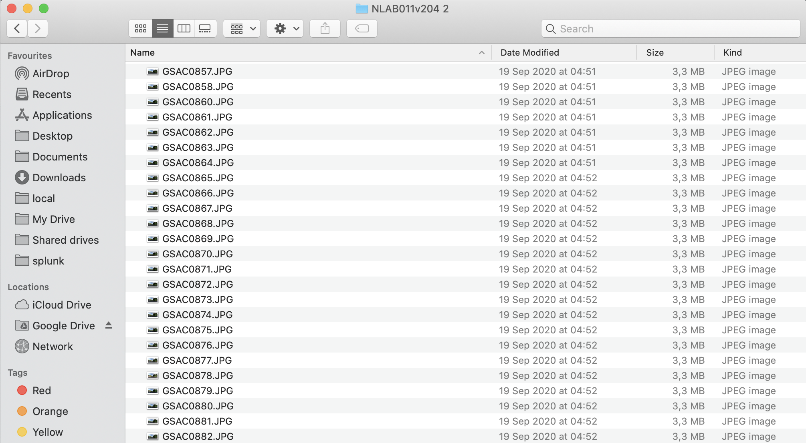
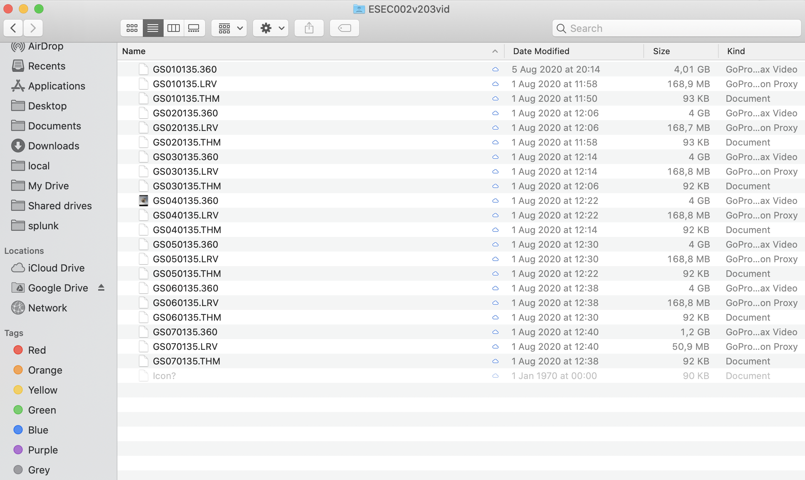
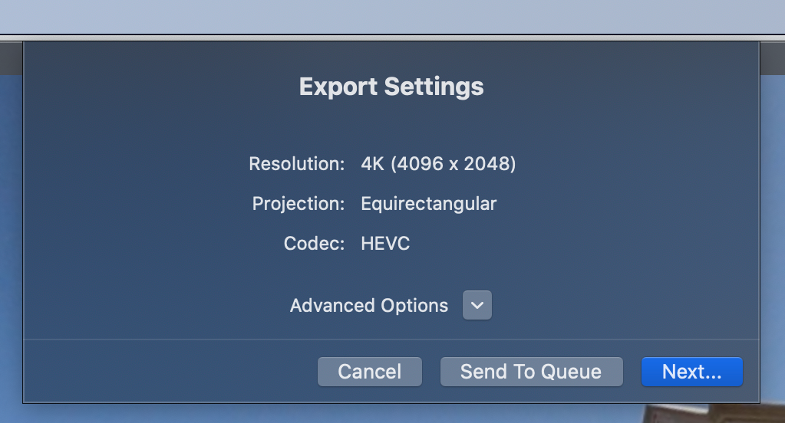
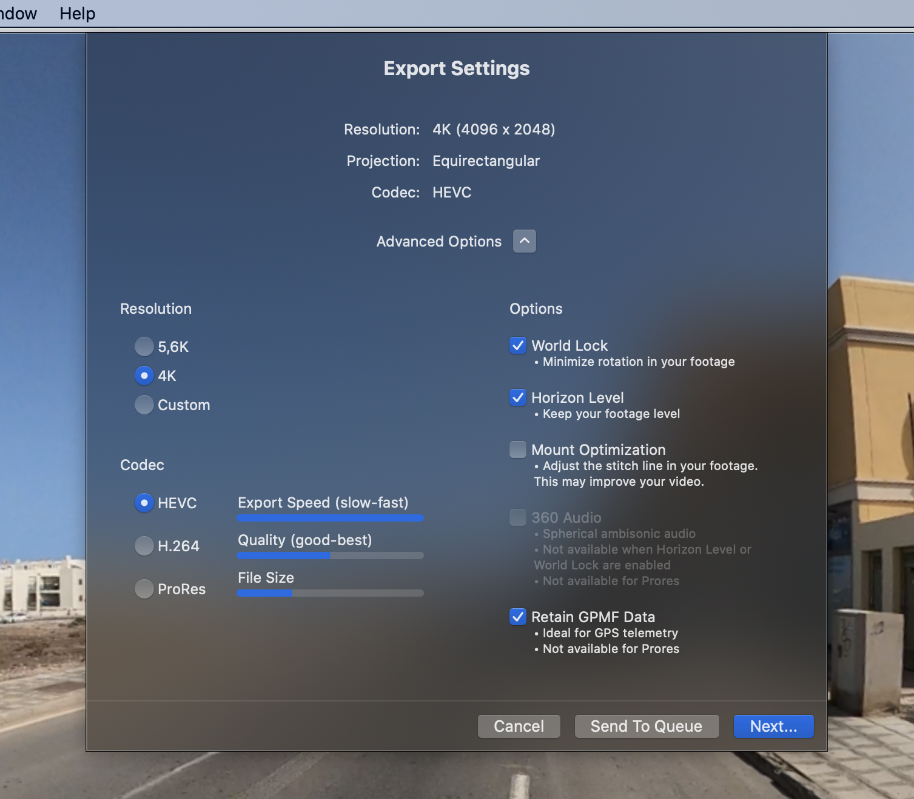
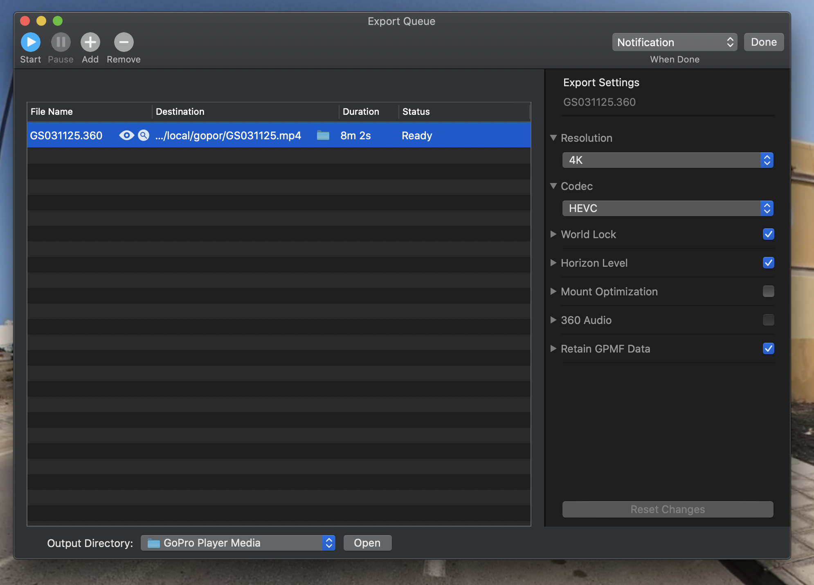

# Processing

Processing steps depend on how you shot imagery:

* [Photo](processing.md#processing-your-photos)
* [Video](processing.md#processing-your-videos)

Once processed, you can use the [Map the Paths Desktop Uploader](http://mtp.trekview.org/uploader) to process and publish the images to various online services.

[Read the Map the Paths Desktop Uploader documentation here.](../../mtp-desktop-uploader/overview.md)

### Processing Your Photos

#### 0. Download GoPro Player

To process videos, you’ll need to download a piece of software called GoPro Player, available here:

[https://community.gopro.com/t5/en/GoPro-Player/ta-p/413305](https://community.gopro.com/t5/en/GoPro-Player/ta-p/413305)

#### 1. Import and prepare your raw photos

After shooting, copy the files for each segment of the tour onto your computer using the MicroSD USB card reader.

Have a look at the photos captured.

In my case, often the first and last 20 photos will be me setting up the camera or stopping. Occasionally I am also disturbed mid-tour \(usually by animals\).

The photos are stitched on the camera, so you only have to remove any unwanted photos before publishing elsewhere.

**1.0.1 A note on filename format**

The photo filename is split into 3 identifying parts \(I'll use `GSAC0857.jpg` as an example\):

* `GS`: always the same. Can be used to identify a photo taken on the MAX.
* `AC`: each time you start and stop the timelapse the latter will increase by one \(`AA`, `AB`, `AC`, `AD`...\)
* 0857: increases by one with each photo in the timelapse

This can be useful information to know when organising tours. For example, you might shoot sequences over multiple shoots. In such cases, knowing the filename behaviour might help you organise them.

### Processing Your Videos


[At the time of writing, only the GoPro Player for Mac will allow you to create `.mp4` videos with GPS telemetry](https://community.gopro.com/t5/Cameras/No-GPS-Data-on-Gopro-MAX-360-mp4-s-GoPro-MAX-Exporter-Windows/m-p/655876#/M154733). If you use a Windows machine, we therefore recommending shooting in timelapse mode OR [capturing a separate `.gpx` track you can stitch into images later using Map the Paths Uploader.](../../mtp-desktop-uploader/developer-docs/functions.md#12-add-gpx-track)


#### 1. Import and prepare your raw videos

After shooting, copy the video files onto your computer using the MicroSD USB card reader.

You'll see 3 types of files:

* `.360`:  a GoPro proprietary video format. This holds the raw video and telemetry. It can only be read by GoPro software, and needs to be processed into another video format for use elsewhere \(see following steps\). **This is the file you'll need for processing.**
* `.LRV`: stands for Low-Resolution Video. These are what you’re actually seeing through the GoPro app when you play back the video.
* `.THM`: stands for Thumbnail. It’s a small image file that’s 160 by 120 pixels. It’s what you see in the GoPro app as the thumbnails to visually represent each video file.

**1.0.1 A note on filename format**

The video filename is split into 3 identifying parts \(I'll use `GS010135.360` as an example\):

* `GS`: always the same. Can be used to identify a video taken on the MAX.
* `01`: \(first 2 digits\) the camera breaks videos longer than 8 min 2 seconds into separate files. Increases by one with each 8 min 2 seconds recorded. For example, a 19 minute video would be split into 3 files \(`GS010135.360`, `GS020135.360`, `GS030135.360)`.
* `0135` increases by one with each new video shot.

#### 2. Add raw files to GoPro Player

Now you have a folder of front and back images on your computer, you can add them to GoPro Player.

#### 3. Exporting to `.mp4`

If you want to upload videos to virtual tour platforms, you need to export videos in .mp4 format \(to retain telemetry\).

To do this, select: file &gt; export &gt; 4k

4k is the maximum resolution that will retain telemetry.

Select advance options dropdown.

Ensure that "World Lock", "Horizon Level", and "Retain GPMF Data" are ticked.

If you want to process more than one video, select "Send to Queue" where you can follow this process again to add multiple videos for batch processing.

Once you've added all the videos you want to process to the queue, select "Start" \(top right of window\).

When complete, you'll have an `.mp4` file in the output directory specified.

